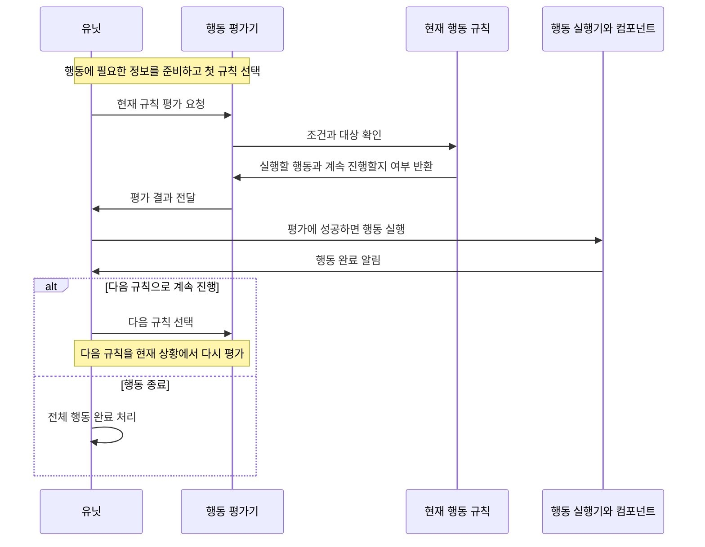
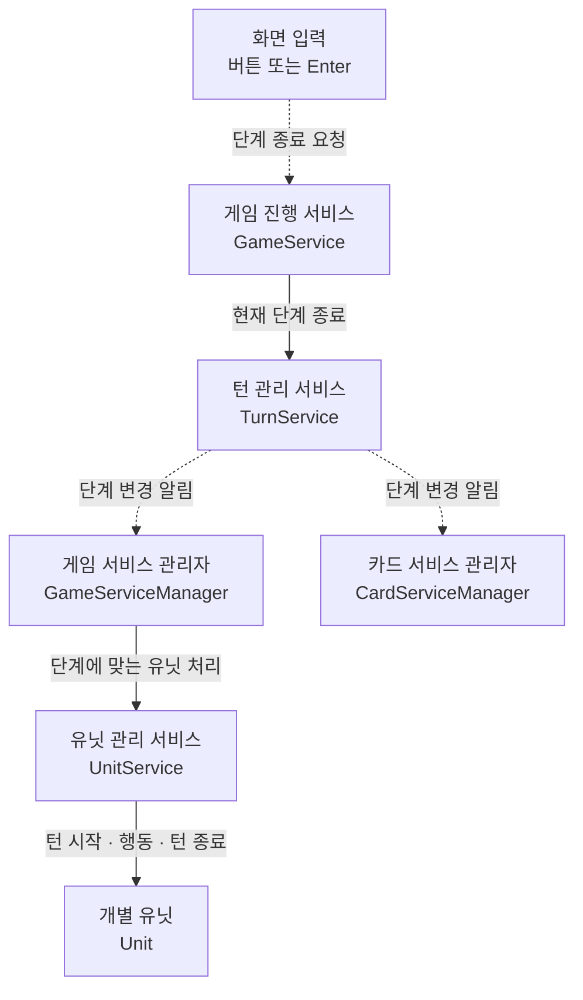
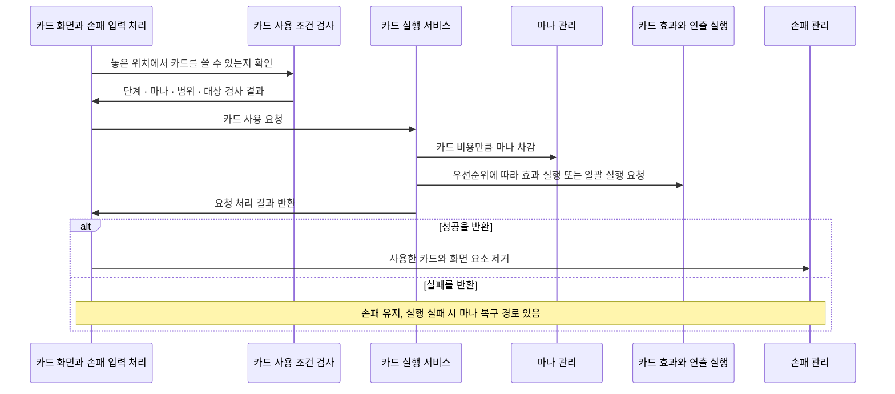
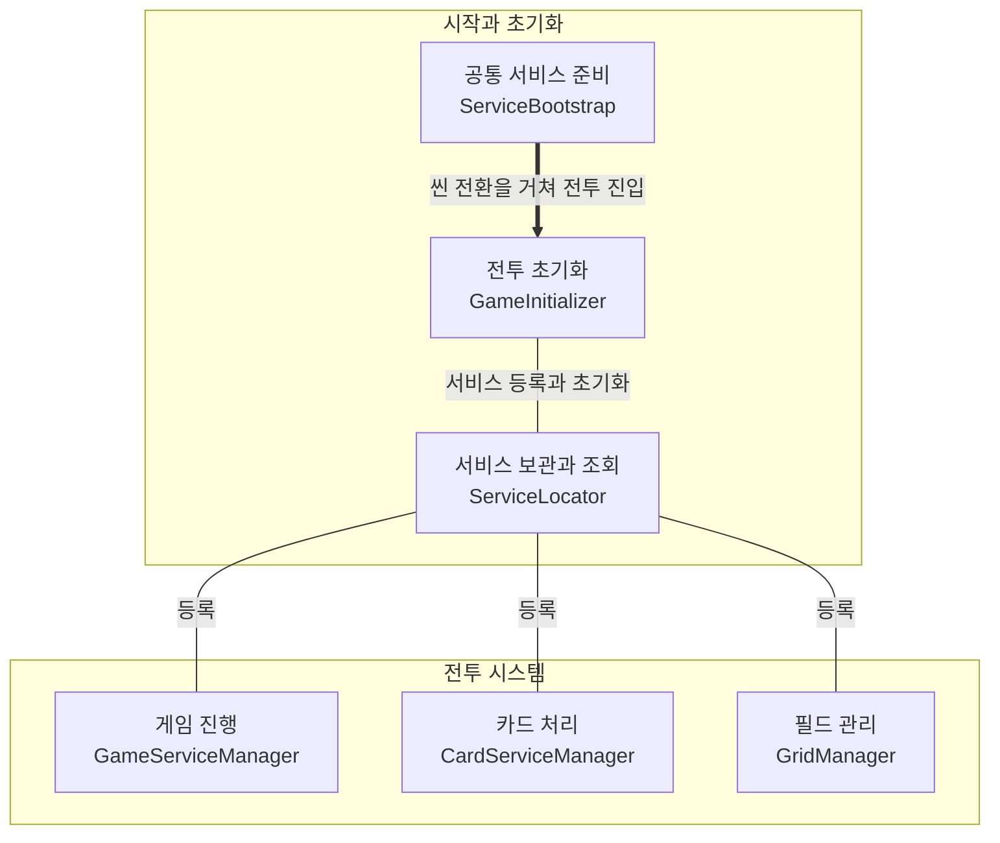

# Urban Tour: 코드 구조와 실행 흐름

> README v4 · 2026-10-01 UTC · 코드 검토를 바탕으로 한 설명
>
> 이 문서는 원본 `feature/carddata-refactoring` 브랜치의 **`8b1f53250f18e622b71ca302cfda816433d14852`** 커밋을 설명한다. 본문의 “현재 코드”도 이 버전을 뜻한다. 예전 README의 3단계 설명이나 원본 `main` 브랜치의 동작과 섞어 읽지 않도록 주의한다.

## 기준 버전과 실행 범위

- 원본: [als79gur49/2025-2TeamProject](https://github.com/als79gur49/2025-2TeamProject). 비공개 저장소다.
- 설명 기준: [8b1f53250f18e622b71ca302cfda816433d14852](https://github.com/als79gur49/2025-2TeamProject/commit/8b1f53250f18e622b71ca302cfda816433d14852).
- 공개 사본: [2025-2TeamProject-code-portfolio](https://github.com/als79gur49/2025-2TeamProject-code-portfolio). 코드 링크는 최초 공개 커밋 `0900af0f82bedc4a8eaca564813189200d42fbf6`에 고정했다. 원본과 공개 사본은 커밋 이력이 서로 다르다.
- 2026-10-01 UTC에 확인한 원본의 기본 브랜치는 `main`이다. `feature/carddata-refactoring`의 마지막 커밋은 위 설명 기준과 일치했다. 당시 `main`의 마지막 커밋 `f938b3502f829ad74d83936e4db52974267111cf`보다 158커밋 앞서고, 뒤처진 커밋은 없었다. `2025-10-17colleage` 브랜치도 함께 조회했다.
- 공개 사본의 [최초 README](https://github.com/als79gur49/2025-2TeamProject-code-portfolio/blob/0900af0f82bedc4a8eaca564813189200d42fbf6/README.md)와 같은 원본 버전을 설명한다. 최초 게시 범위와 검증 기록은 맨 아래 부록에 남겼다.

**공개 사본은 코드를 읽기 위한 자료이며, 바로 실행할 수 있는 Unity 프로젝트는 아니다.** 씬, 프리팹, 이미지·음원 등의 자산, 실제 ScriptableObject 데이터, 외부 DLL, Unity `.meta` 파일은 포함하지 않았다. `ReviewContext/Packages/`와 `ReviewContext/ProjectSettings/`는 원본 환경을 확인하기 위한 자료다. 패키지만 설치해서는 사본을 실행할 수 없다.

원본 환경 자료에는 Unity **2022.3.62f1**, URP 14.0.12, TextMeshPro 3.0.7, Cinemachine 2.10.5 등이 기록되어 있다. 코드에는 DOTween/Pro 참조도 남아 있다. 실행하려면 원본 전체 프로젝트와 필요한 자산·라이브러리, 원본 씬 구성이 필요하다. 이번 작업에서는 빌드나 Unity 실행, 플레이 테스트를 하지 않았다. 실제 카드 수치, Inspector 연결, 애니메이션 결과도 확인하지 않았다.

## 1. 유닛이 행동을 고르고 실행하는 순서

**유닛은 우선순위에 따라 정렬된 행동 규칙을 하나씩 평가한다. 행동이 끝나면 다음 규칙으로 넘어가 그때의 상황을 다시 평가한다.**

여기서 행동 규칙은 `Modifier`, 규칙을 평가하는 객체는 `ActionEvaluator`다. 이렇게 규칙을 순서대로 따라가는 구조를 코드에서는 행동 체인이라고 부른다.



그림에서는 실행기와 컴포넌트를 하나로 묶었다. 평가에 실패하면 실행은 건너뛰고, 아래 규칙에 따라 다음 평가로 넘어가거나 종료한다.

- **행동 규칙 준비:** [Unit.Init()][unit]가 `UnitData`에 정의된 규칙을 생성하고 등록한다. 각 규칙의 `Priority`는 평가 순서를 정한다. `Evaluate`는 조건과 대상 선택기를 확인해 공격할 타일, 이동할 위치, 성공 여부, 다음 규칙으로 진행할지 여부를 [ActionResult][action-interface]에 담는다.
- **현재 규칙 평가:** [RebuildChain()][evaluator]은 우선순위가 높은 규칙부터 정렬한다. `EvaluateNextAction`은 현재 규칙을 평가하며, 실패해도 `ShouldContinueChain`이 참이면 다음 규칙을 평가한다. 모든 행동의 점수를 비교해 가장 높은 행동을 고르는 방식은 아니다.
- **선택한 행동 실행:** 유닛의 `EvaluateAndExecuteNextAction`이 성공한 평가 결과를 저장하고 [Registry.TryExecute()][executors]로 행동 종류에 맞는 실행기를 호출한다. 최종 평가에 실패하거나 남은 규칙이 없으면 전체 행동을 끝낸다.
- **완료 후 다음 행동 결정:** [OnActionCompleted()][unit]는 `ShouldContinueChain`을 확인한다. 계속 진행해야 하면 `MoveToNextModifier`로 다음 규칙을 선택하고 **새로 평가한다.** 성공 후에도 계속하는 규칙은 `AlwaysContinue`와 `ContinueOnSuccess`이며, `FallbackOnFailure`와 `AlwaysTerminate`는 성공 후 종료한다. 규칙의 순서는 유지되지만, 대상과 실행 가능 여부는 매번 평가할 때 정한다.

## 2. 한 턴의 여섯 단계

[TurnPhase][phase]와 [TurnService.GetNextPhase()][turn]에 정의된 순서는 다음과 같다.

**턴 시작 → 적 소환 → 아군 소환 → 적 행동 → 아군 행동 → 턴 종료 → 다음 턴**

`StartGame`은 `TurnCount`와 `PhaseCount`를 0으로 시작한다. `EndCurrentPhase`가 성공할 때마다 단계 수가 늘어나고, 여섯 번 전환할 때마다 턴 수가 늘어난다. 화면에는 `TurnCount + 1`을 표시하므로 첫 턴은 1로 보인다. 단계 수를 확인할 때는 과거 문서나 일부 화면 문구보다 단계 정의와 전환 코드를 기준으로 삼는다.



일반적인 전환 요청은 `UIService.OnEndTurnRequested` → [GameService.HandleEndPhaseRequest()][game-service] → `TurnService.EndCurrentPhase` 순서다. 단계가 바뀌면 `OnPhaseChanged` 이벤트로 알린다. 그림은 이 이벤트를 받는 객체들의 실행 순서를 뜻하지 않는다.

| 단계 | 카드와 마나 처리 | 유닛 처리 |
| --- | --- | --- |
| 턴 시작 (`TurnStart`) | 양 팀의 최대 마나 증가와 전량 충전, 플레이어의 `DrawRandomCard`, 적의 `DrawCard(1)` | `OnTurnStart`: 이동·추가 행동 상태 초기화, 턴 시작 효과 적용 |
| 적 소환 (`EnemySummon`) | 적 AI가 사용할 카드를 계획하고 순서대로 실행 | 처리할 유닛 목록이 비어 있음 |
| 아군 소환 (`AllySummon`) | 플레이어가 손패를 끌어다 사용할 수 있음 | 처리할 유닛 목록이 비어 있음 |
| 적 행동 (`EnemyAction`) | 플레이어의 소환 모드 비활성화 | 적 유닛의 `Act`를 순서대로 호출 |
| 아군 행동 (`AllyAction`) | 플레이어의 소환 모드 비활성화 | 플레이어 유닛의 `Act`를 순서대로 호출 |
| 턴 종료 (`TurnEnd`) | 카드 관리자의 준비·정리 메서드는 현재 로그만 출력 | `OnTurnEnd`: 종료 효과 적용, 지속시간과 추가 행동 자격 정리 |

[ResourceManager.IncreaseTurnlyMana()][resources]는 양 팀의 최대 마나를 상한까지 1씩 늘린 뒤 모두 채운다. 자원 관리자가 별도로 단계 변경을 구독하는 코드는 주석 처리되어 있다. 따라서 소환 단계에서 마나가 추가로 회복된다고 설명하지 않는다.

`GameFlowLock`이나 `PhaseLock`이 걸려 있으면 `EndCurrentPhase`는 전환을 거절한다. 종료 버튼도 실행 상태와 잠금에 맞춰 비활성화된다. 다만 Enter 입력은 버튼의 활성 여부인 `interactable`을 검사하지 않는다.

실행 도중 들어온 종료 요청은 `CancelCurrentPhase(true)`를 거칠 수 있다. 이 경로는 진행 중인 코루틴을 중단하고 현재 순번부터 남은 유닛의 `Act`를 호출한다. 이때 단계 종류를 구분하지 않으므로, 모든 행동이 정상적으로 끝날 때까지 기다리거나 연출 없이 계산만 처리하는 경로로 보아서는 안 된다.

## 3. 카드를 뽑고 사용하는 과정

### 초기 손패와 카드 뽑기

[CardHandManager.Init()][hand]는 Inspector에 지정된 `initialHandCards`를 손패에 넣는다. 저장된 덱을 불러오면 [CardServiceManager.LoadPlayerDeck()][card-manager] → `LoadDeck` → `SetupInitialHandFromDeck` 순서로 기존 손패를 비우고, 섞은 덱에서 초기 손패를 뽑는다.

`DrawRandomCard`의 처리 순서는 다음과 같다.

1. 초기화 여부와 손패 수 제한을 확인한다.
2. 덱에서 다음 카드를 꺼낸다.
3. 덱에서 가져올 수 없으면 `availableCards`에서 무작위로 고른다.
4. `AddCardToHand`로 손패에 추가하고 화면 배치를 갱신한다.

**불러온 덱을 모두 쓴 경우에도 무작위 선택으로 넘어갈 수 있다.** 적의 `DrawCard`는 카드 풀의 뽑기 규칙에 따라 `enemyHand`에 카드를 넣고 `OnCardDrawn`을 알린다. 카드를 뽑는 규칙과 4절의 사용 카드 조합 선택은 서로 다른 처리다.

### 손패 한 장을 끌어다 놓았을 때



1. [CardUIRefactored][card-ui]가 현재 입력 처리 방식에 입력을 전달한다. 손패를 다루는 [InHandStrategy.HandleDrop()][in-hand]은 광선 검사(`raycast`)로 놓인 타일을 찾고 위치를 다시 검증한다.
2. [SpawnValidator.CanUseCard()][validator]가 진행 잠금, 마나, 팀별 소환 단계, 좌표, 대상 종류, 기지로부터의 범위, 효과를 받을 대상의 존재를 확인한다. 플레이어는 아군 소환 단계, 적은 적 소환 단계에서만 카드를 사용할 수 있다.
3. [CardSpawnService.TryExecuteCard()][spawn]는 `GameContext`에 사용 카드, 시전자 팀, 기준 위치, 필요한 서비스를 담고 마나를 먼저 차감한다. 효과 정의가 없는 카드는 거절한다. 효과 실행에 실패하면 마나를 복구하는 경로가 있다.
4. 성공(`true`)을 반환하면 `InHandStrategy.OnCardUsed` → `RemoveCardFromHand(card, cardUI)`로 사용한 카드와 화면 요소를 제거한다. 실패(`false`)하면 손패의 위치와 배치를 복원한다.

`TryExecuteCard` 내부에서는 `CanUseCard`의 전체 검사를 반복하지 않는다. 따라서 이 메서드를 직접 호출할 때는 손패 입력 처리나 적 AI처럼 사용 조건을 별도로 검사해야 한다.

### 효과 정의에서 실제 적용까지

[CardData][card-data]에는 [EffectDefinition][definition] 목록이 있다. [CardEffectFactory][factory]는 이 정의를 실행 가능한 효과 객체로 만들고 우선순위가 높은 순서로 정렬한다.

효과 정의에는 범위 모양, 대상 선별 조건, 타일 기준 여부(`TileBased`/`Global`), 시각 효과(`VFX`) 설정이 들어 있다. [EffectTargetingHelper][targets]는 `AreaShape`로 구한 후보에서 `TargetFilter` 조건에 맞는 대상을 고른다. `Global` 효과는 타일 목록을 대상으로 삼지 않는다. 예를 들어 [DrawCardsEffect][draw]는 대상 팀을 정한 뒤 `DrawCardsForTeam`을 호출한다.

시각 효과 설정과 실행기가 있으면 [SpellEffectExecutor.ExecuteBatch()][spell]에 일괄 실행을 요청한다. 정렬된 첫 효과의 시각 효과 설정을 사용하며, 대상 계산 결과와 발동 시점(`trigger`)에 따라 효과를 호출한다. 이 과정에서 게임 진행 잠금을 요청하고 해제한다. **따라서 `TryExecuteCard`가 성공을 반환한 시점과 피해·소환이 실제로 적용된 시점은 다를 수 있다.**

[SummonEffect.SummonUnitAtTile()][summon]의 소환 순서는 다음과 같다.

**프리팹 생성 → `Unit.Init` → `UnitCardLink`로 카드 연결 → `GridController.MoveUnit`으로 배치 → `UnitService.RegisterUnit`으로 등록 → 현재 타일과 팀 방향 설정**

`OnDeploy` 효과는 직접 호출하지 않는다. 그리드의 최초 배치 이벤트 → [UnitPlacementCoordinator.HandleUnitPlaced()][placement] → `Unit.OnPlaced`를 거쳐 적용된다. 이 이벤트는 유닛 관리 서비스에 등록되기 전에 발생할 수 있다.

코드에서 확인한 주의점은 다음과 같다.

- 연출을 거치는 경로의 성공 반환은 모든 효과가 끝났거나 성공했다는 뜻이 아니다. 즉시 실행하는 경로도 `successCount > 0`이면 성공으로 처리하며, 이미 적용한 효과를 한꺼번에 되돌리는 기능은 없다.
- 새 [GameContext][context]의 `PredeterminedTiles`는 비어 있다. 연출 없이 직접 실행하는 경로에서는 이 목록을 채우지 않으므로, [SummonEffect][summon]와 [DamageEffect][damage]의 `CanExecute` 검사는 실패한다. 연출 유무와 관계없이 모든 효과가 똑같이 동작한다고 볼 수 없다.
- 연출 경로에서는 여러 효과의 대상 타일을 합쳐 실행 정보에 담는다. 효과별 발동 시점과 선별 조건이 있으므로, 즉시 실행 경로와 대상 처리 방식이 같다고 단정하지 않는다.

## 4. 적 AI가 사용할 카드 조합을 고르는 방법

[EnemyAIController][enemy]는 **적 손패에서 사용할 카드**를 계획한다. 1절의 유닛 행동 선택과는 별개다.

1. `ExecuteSummonPhaseCoroutine`이 마나와 손패를 읽고, `PlanCardsForCurrentState`가 비용을 낼 수 있는 카드를 평가한다.
2. `CalculateBestSituationalValue`가 각 후보 위치에 배치할 수 있는지 확인하고 `CalculateValueAtPosition`의 점수를 비교한다. 가장 높은 점수와 위치를 [CardValueInfo][value]에 저장한다. 후보 위치가 없거나 전체 타일의 80%를 넘으면 전체 타일을 탐색하는 분기도 사용한다.
3. 점수가 양수인 카드를 [KnapsackCardSelector.SelectOptimalCards()][knapsack]로 넘겨 조합을 고른다.
4. `ExecuteSelectedCardsCoroutine`은 카드마다 진행 잠금과 마나를 확인한다. `RevalidateAndMaybeRecalculate`로 위치와 점수도 다시 검사하며, 더 이상 유효하지 않거나 점수가 없으면 재평가하거나 건너뛴다.
5. `TryExecuteCard(..., Enemy)`가 성공하면 적 손패에서 카드를 제거하고 `OnCardUsed`를 알린다. 상태가 바뀌면 다시 계획할 수 있다. 재계획은 최대 5회이며, 성공한 카드 수의 합이 20 이상이면 바깥 반복문을 끝낸다. 선택 목록을 정확히 20장으로 잘라 실행하는 방식은 아니다.

카드 점수는 소환의 체력 + 공격력 + 이동 범위, 피해의 대상 수 × 피해량, 뽑을 카드 수 × 2처럼 정해진 계산 규칙으로 추정한다. 이런 근사 평가를 **휴리스틱**이라고 한다. 미래 턴이나 모든 효과·대상 조건·카드 간 조합 효과를 완전히 모의 실행한 결과는 아니다.

### 마나 안에서 점수 합이 가장 큰 조합 선택

카드 후보가 N개이고 마나가 M일 때, 동적 계획법(`DP`)으로 조합을 구한다. `dp[i,w]`에는 앞의 i개 후보 중에서 마나 w 이하로 얻을 수 있는 가장 큰 점수 합을 저장한다.

```text
카드 비용이 남은 마나보다 크면:
    dp[i,w] = dp[i-1,w]

그 외에는 현재 카드를 쓰는 경우와 쓰지 않는 경우를 비교:
    dp[i,w] = max(dp[i-1,w], value + dp[i-1,w-cost])
```

항상 이전 행을 참조하므로 손패의 같은 항목을 두 번 고르지 않는다. 이를 **0/1 배낭 문제** 방식이라고 한다. 같은 카드가 여러 장이면 각 장을 별도 항목으로 취급한다. 표의 행별 차이를 거슬러 올라가 선택된 카드를 찾고, 순서를 뒤집어 최종 목록을 만든다. 시간과 메모리 사용량은 O(N×M)이다.

예를 들어 마나가 5이고 A는 비용 3·점수 8, B는 비용 2·점수 6, C는 비용 4·점수 9라면 A와 B를 골라 점수 합 14를 얻는다.

이 방식이 최적화하는 것은 **계획 시점에 계산한 카드별 점수의 합**이다. 실행 후에는 타일 점유와 효과 대상이 바뀌므로 게임 전체에서 가장 좋은 전략을 보장하지 않는다. 또한 `maxMana ≤ 0`이면 빈 목록을 반환하고, 역추적 중 남은 마나가 0이면 멈춘다. 따라서 비용이 0인 카드까지 항상 최적으로 선택한다고 볼 수는 없다.

## 5. 주요 시스템의 구성

전투 코드는 크게 턴 진행, 카드·유닛 처리, 화면·필드 표시로 나뉜다. 아래 그림은 시작 지점과 주요 서비스가 등록되는 관계를 보여준다.



메뉴와 스테이지 씬 등 중간 경로는 생략했다. `GameInitializer`는 전투 씬에 들어간 뒤 초기화하는 부분이다. `ServiceLocator`는 서비스 객체를 보관하고 찾아주는 역할을 한다. 그림의 연결선이 서비스 생성이나 실행 지시를 뜻하는 것은 아니다.

각 시스템의 구성은 아래와 같다. 나열한 순서는 실행 순서가 아니다.

| 주요 시스템 | 하위 구성과 역할 |
| --- | --- |
| `GameServiceManager` | `TurnService`: 턴 단계 관리<br/>`UnitService`: 유닛 순차 처리<br/>`UIService`: 화면 표시와 입력<br/>`GameService`: 게임 활성 상태 관리 |
| `CardServiceManager` | `CardHandManager`: 플레이어 손패<br/>`SpawnValidator`: 카드 사용 조건 검사<br/>`CardSpawnService`: 카드 효과 실행 연결<br/>`EnemyAIController`: 적 손패 사용 계획과 실행<br/>`EnemyCardHandView`: 적 손패 표시 |
| `GridManager` | `GridState`: 좌표와 점유 정보<br/>`GridController`: 상태 조회, 경로 탐색, 갱신<br/>`GridRenderer`: 타일 표시, 강조, 미리보기 |

단계별 호출은 2절에서, 카드 한 장을 사용하는 순서는 3절에서 확인할 수 있다.

## 6. 게임 상태가 화면과 입력에 반영되는 과정

| 상태 변화 또는 입력 | 연결되는 처리 |
| --- | --- |
| 턴 단계 변경 | `TurnService` 이벤트 → `UIService`의 글자·색상·이미지 갱신, 카드 관리자의 소환 모드 변경 |
| 유닛 처리 시작·완료·취소 | `UnitService` 이벤트 → 종료 버튼과 진행 표시 갱신 |
| 진행 잠금 변경 | [GlobalStateManager][global-state] 이벤트 → `UIService`, `CardHandManager`, `SpawnValidator`의 입력 제한 |
| 마나 변경 | `ResourceManager` 이벤트 → [ManaHudUI][mana-ui]의 숫자와 슬라이더 갱신 |
| 카드 뽑기·사용 | 플레이어는 `CardHandManager`가 목록과 화면을 직접 갱신. 적은 `OnCardDrawn`/`OnCardUsed` 이벤트로 손패 표시 갱신 |
| 카드에 대한 포인터 입력 | `CardUIRefactored` → 현재 모드의 입력 처리 → 카드 정보·드래그 이벤트 전달과 필드 미리보기 |
| 기지 사망 | `BaseManager` → `GameOutcomeManager` → `GameService`의 게임 종료와 `GameUICoordinator`의 승패 화면 표시 |

`GlobalStateManager`는 잠금 종류별로 요청한 객체들을 관리한다. `SetBusy(requester, type)`로 잠금을 요청하고 `SetIdle(requester, type)`로 해제한다. 마지막 요청자까지 해제하면 상태 변경 이벤트를 보낸다. 제한 시간이 지나면 자동으로 해제하는 처리도 있다.

이 코드의 “전역 상태”는 주로 게임 진행이나 연출이 처리 중인지 여러 시스템이 공유하는 상태를 뜻한다. 손패를 비롯한 모든 게임 데이터를 한곳에 저장한다는 뜻은 아니다.

## 7. 게임 시작과 서비스 연결

### 시작부터 전투 준비까지

원본의 [EditorBuildSettings.asset](https://github.com/als79gur49/2025-2TeamProject/blob/8b1f53250f18e622b71ca302cfda816433d14852/ProjectSettings/EditorBuildSettings.asset)에서 첫 번째로 활성화된 씬은 `Assets/Scenes/TestScenes/Prototypes/BootStrapScene.unity`다.

[ServiceBootstrap.Awake()][bootstrap]는 중복 생성을 막고 `DontDestroyOnLoad`를 적용한 뒤 씬 로더, 오디오, 카드 조회, 저장, 플레이어·스테이지 진행, 씬 전환, 공통 화면 서비스를 초기화한다. `Start`는 저장된 `initialSceneData` 설정으로 씬 전환을 요청한다. 다음에 어떤 씬이 열리는지는 코드만으로 확정할 수 없다.

전투 씬의 [GameInitializer.Start()][initializer]는 `autoInitializeOnStart`가 켜져 있으면 `InitializeGame`을 호출한다. 준비 순서는 다음과 같다.

1. 공통 초기화 여부에 따라 서비스 보관소를 유지하거나 초기화한다.
2. 스테이지 정보를 준비한다.
3. 진행 상태, 그리드, 행동 규칙 생성기, 게임, 자원, 카드, 시각 효과, 기지, 승패, 화면 표시, 사망 처리 서비스를 등록한다.
4. `HealthComponent`에 필요한 객체를 전달한다.
5. 설정을 검증하고 `MarkAsInitialized`로 초기화 완료를 표시한다.
6. 데이터가 있으면 게임 세션을 준비한다.
7. [SceneInitializer][scene-init]로 화면과 시스템 간 연결 담당 객체를 초기화한다.

실제 전투 시작은 [GameServiceManager.Start()][game-manager]에서 하위 컴포넌트를 준비하고 이벤트를 연결한 뒤 진행한다.

**`TurnService.Init` → `UnitService.Init` → `UIService.Init` → `GameService.Init` → 기지 초기화 → `GameService.StartGame` → `TurnService.StartGame`**

원본 `.meta`의 실행 순서 설정(`executionOrder`)은 [GameInitializer](https://github.com/als79gur49/2025-2TeamProject/blob/8b1f53250f18e622b71ca302cfda816433d14852/Assets/Script/Game/Core/GameInitializer.cs.meta)가 −3, [GameServiceManager](https://github.com/als79gur49/2025-2TeamProject/blob/8b1f53250f18e622b71ca302cfda816433d14852/Assets/Script/Game/Services/GameServiceManager.cs.meta)가 0이다. 카드 초기화 과정에서 게임 관리자의 `Start` 전에 하위 서비스를 조회할 수 있으므로 Inspector 연결이 중요하다. 이 설정 파일과 씬은 공개 사본에 포함하지 않았다.

### 필요한 서비스를 찾고 전달하는 방식

[ServiceLocator][locator]는 `Dictionary<Type, object>`에 서비스 객체를 보관한다. `Register<TInterface>`로 등록하고 `Get<TInterface>`로 조회한다. 등록되지 않은 서비스를 찾으면 경고와 `null`을 반환하며, 같은 타입을 다시 등록하면 기존 값을 덮어쓴다.

| 조회에 사용하는 인터페이스 | 얻을 수 있는 기능 |
| --- | --- |
| `IGameServiceManager` | 턴, 유닛, 화면, 게임 진행 서비스 |
| `IGridManager` | 필드 제어, 점유 정보, 화면 표시 |
| `ICardServiceManager` | 손패 관리, 카드 사용 검사와 실행, 적 손패 표시 |
| `IResourceManager` / `IGlobalStateManager` | 마나 관리 / 진행 잠금 |
| `ICardRegistry` | 카드 ID로 카드 조회 |

`CardServiceManager.InitializeCardServices`는 그리드·턴·유닛 서비스를 조회한 뒤 `SpawnValidator.Init`, `CardSpawnService.Init`, `CardHandManager.Init`, `EnemyAIController.Initialize`에 전달한다. 카드의 하위 서비스를 보관소에 각각 등록하지는 않는다.

`[Inject]` 표시를 실행 중에 읽어 필요한 객체를 넣는 리플렉션 처리도 있다. 다만 실제 코드에서는 `Init` 인자로 전달하기, 보관소에서 직접 조회하기, `GetComponent` 호출, Inspector에서 구체 클래스 연결하기를 함께 사용한다. `ServiceLocator`가 서비스 생성이나 초기화 순서를 자동으로 보장하지는 않는다.

## 8. 코드를 읽을 때 따라갈 순서

아래 파일은 모두 `Assets/Script/` 아래에 있다. 더 자세한 경로와 메서드 목록은 부록에서 확인할 수 있다.

1. [UnitService.cs][units] → [Unit.cs][unit]: 단계별 대상 유닛, 처리 순서, 완료 대기, `Act`의 분기부터 읽는다.
2. [ActionEvaluator.cs][evaluator] → [IActionModifier.cs][action-interface] → [ModifierFactory.cs][modifier-factory]: 현재 평가할 규칙, 다음 규칙으로 넘어가는 조건, `UnitData`에서 규칙을 등록하는 과정을 확인한다.
3. [NormalMoveModifier.cs][move-modifier] / [MeleeModifier.cs][melee-modifier] → [TargetSelectorProvider.cs][selector-provider]: 행동 조건과 대상 후보를 만드는 규칙을 읽는다.
4. [ActionExecutorRegistry.cs][executors] → [MovementActionExecutor.cs][move-executor] / [AttackActionExecutor.cs][attack-executor] → [MovementComponent.cs][movement] / [CombatComponent.cs][combat]: 위치와 체력이 바뀌는 지점부터 유닛에 완료를 알리는 부분까지 따라간다.
5. [TurnPhase.cs][phase] → [TurnService.cs][turn] → [GameService.cs][game-service]: 현재 처리가 끝나는 시점과 다음 단계로 넘어가는 요청을 구분한다.
6. [CardHandManager.cs][hand] → [InHandStrategy.cs][in-hand] → [SpawnValidator.cs][validator] → [CardSpawnService.cs][spawn] → [SpellEffectExecutor.cs][spell] / [SummonEffect.cs][summon]: 카드 뽑기부터 효과 적용과 유닛 등록까지 따라간다.
7. [EnemyAIController.cs][enemy] → [CardValueInfo.cs][value] → [KnapsackCardSelector.cs][knapsack]: 카드 위치 평가, 마나에 맞는 조합 선택, 실행 전 재검사를 읽는다.
8. [ServiceBootstrap.cs][bootstrap] → [GameInitializer.cs][initializer] → [ServiceLocator.cs][locator] → [GameServiceManager.cs][game-manager] / [CardServiceManager.cs][card-manager]: 앞에서 읽은 서비스들이 어디에서 준비되는지 확인한다.
9. [UIService.cs][ui] → [ManaHudUI.cs][mana-ui] → [GlobalStateManager.cs][global-state] → [GameOutcomeManager.cs][outcome]: 화면 표시, 입력 제한, 진행 잠금, 게임 종료를 연결해 읽는다.

## 9. 확인한 내용과 아직 검증하지 못한 부분

메서드 호출, 조건 분기, 데이터 변경은 위에 명시한 버전의 코드에서 확인했다. 평가 결과와 실행기를 나눈 구조는 판단과 실행의 역할을 구분하려는 설계로 해석할 수 있다. 다만 이런 해석만으로 순수 함수 구성, SOLID 원칙 준수, 설계 완성도, 성능이나 테스트 통과를 증명할 수는 없다.

각 절에서 설명한 주의점 외에 다음 사항도 남아 있다.

- 일부 행동 규칙은 내부에서 실패 시 대체 처리를 수행하고, 평가기 역시 다음 규칙으로 넘어간다. `SelectedModifier`와 평가기가 가리키는 규칙이 달라질 수 있으므로 각 규칙이 정확히 한 번씩 실행된다고 보장할 수 없다. `ActionContext.ActorPosition`을 생성한 뒤 이동 완료에 맞춰 갱신하는 대입도 찾지 못했다.
- `Registry.TryExecute`의 성공 반환은 실행기를 호출했다는 뜻이다. 이동 실패 반환값을 확인하지 않거나 컴포넌트가 없어 완료를 알리지 않는 분기도 있다. `UnitService`는 애니메이션 재생 여부를 확인한 뒤 조건에 따라 전역 진행 잠금을 최대 20초 기다린다. 제한 시간이 지나 잠금이 풀린 것을 정상적인 행동 완료로 볼 수는 없다.
- 씬·프리팹·실제 데이터·외부 라이브러리가 없어 Inspector 연결, 실제 연출, 플레이 결과를 검증하지 않았다.
- `EnemyAIController.Initialize`는 유효한 카드 풀이 없으면 초기화 완료 표시를 설정하지 않고 끝난다. 이후 `SetCardPool`도 이 표시를 참으로 바꾸지 않으므로, 스테이지 데이터를 넣는 것만으로 초기화가 복구된다고 단정할 수 없다.
- `UIService`의 일반 표시는 전체 여섯 단계(`/6`)이지만, `HandlePhaseStarted`의 처리 중 문구에는 네 단계(`/4`)가 남아 있다.
- `CardData.ExecuteCard`와 `BasicUnitAI`가 존재하더라도 현재 카드 사용과 `Act`의 실행 경로로 소개하지 않는다.
- [최초 README](https://github.com/als79gur49/2025-2TeamProject-code-portfolio/blob/0900af0f82bedc4a8eaca564813189200d42fbf6/README.md)에 기록된 패키지 누락, 에디터 전용 참조, 테스트의 이전 API 참조도 실행을 제한하는 요소다.

이번 갱신은 README의 표현만 다듬었다. 소스나 자산을 수정하지 않았으며 Unity 실행, 빌드, 플레이 테스트도 하지 않았다. 도표는 코드 블록과 노드·연결 관계를 확인했지만, GitHub에서 실제로 표시되는 글꼴·간격·넘침까지 검증한 것은 아니다.

## 부록. 참고할 파일과 이전 검증 기록

<details>
<summary>파일 경로, 주요 메서드, 이전 검증 기록 보기</summary>

코드 링크는 공개 사본 `0900af0f82bedc4a8eaca564813189200d42fbf6`의 파일에 고정되어 있다. 파일 안에서 아래 메서드 이름을 검색하면 관련 조건과 호출부를 함께 읽을 수 있다.

| 근거 경로 (Assets/Script/ 기준) | 주요 메서드·요소 |
| --- | --- |
| [Game/Core/ServiceBootstrap.cs][bootstrap] | Awake, InitializeServices, Start, LoadInitialSceneAsync |
| [Game/Core/GameInitializer.cs][initializer] | Start, InitializeGame, RegisterCoreServices, RegisterGameServices, RegisterCardServices |
| [Game/Core/SceneInitializer.cs][scene-init] | InitializeSceneWorkflow |
| [Game/Core/ServiceLocator.cs][locator] | Register, RegisterSingleton, Get, Clear, MarkAsInitialized, InjectDependencies |
| [Game/Services/GameServiceManager.cs][game-manager] | Start, InitializeServices, InitializeIndividualServicesManually, ConnectServiceEvents, HandlePhaseChanged |
| [Game/Services/GameService.cs][game-service] | StartGame, HandleEndPhaseRequest, EndGame, RestartGame |
| [Game/Managers/CardServiceManager.cs][card-manager] | InitializeCardServices, LoadPlayerDeck, HandlePhaseChanged, HandleTurnStartPhase, DrawCardsForTeam |
| [Game/Services/TurnPhase.cs][phase] | TurnPhase, PhaseExecutionState |
| [Game/Services/TurnService.cs][turn] | StartGame, EndCurrentPhase, GetNextPhase |
| [Game/Services/UnitService.cs][units] | GetActiveUnits, GetUnitsInGridOrder, ProcessUnitsForPhaseAsync, GetUnitsForPhase, ExecutePhaseSequentially, ProcessUnitActionAsync, WaitForAnimationComplete, CompleteCurrentPhase, CancelCurrentPhase |
| [Game/Services/ResourceManager.cs][resources] | IncreaseTurnlyMana, SpendResources, ConnectToTurnService, NotifyResourceChanged |
| [ScriptableObjects/CardData.cs][card-data] | EffectDefinitions, IsEffectBasedCard, ExecuteCard |
| [Game/Services/Card/CardHandManager.cs][hand] | Init, LoadDeck, SetupInitialHandFromDeck, DrawRandomCard, AddCardToHand, RemoveCardFromHand |
| [Game/Card/UI/Refactored/CardUIRefactored.cs][card-ui] | OnBeginDrag, OnDrag, OnEndDrag, CreateContextForMode |
| [Game/Card/UI/Refactored/Strategies/InHandStrategy.cs][in-hand] | HandleDrop, ValidateDropPosition, OnDragEndInternal, OnCardUsed |
| [Game/Services/Card/SpawnValidator.cs][validator] | CanUseCard, ValidatePhaseForSpawn, ValidateTargetRange, HasAnyValidEffectTarget |
| [Game/Services/Card/CardSpawnService.cs][spawn] | TryExecuteCard, UpdateGameContext, ExecuteAllCardEffects, RestoreResources |
| [Game/Card/Effects/CardEffectFactory.cs][factory] | CreateEffect, CreateEffects |
| [Game/Card/Effects/EffectDefinition.cs][definition] | CreateRuntimeEffect, Priority, AreaShape, TargetFilter, TargetScope |
| [Game/Card/Effects/EffectTargetingHelper.cs][targets] | GetTargetTiles, GetAreaTiles |
| [Game/Card/Effects/GameContext.cs][context] | GameContext, PredeterminedTiles, IsValid |
| [Game/VFX/SpellEffectExecutor.cs][spell] | ExecuteBatch, ExecuteWithVFX, CalculateAllPotentialTargets, ExecuteEffectsWithDataList, ExecuteGlobalEffect |
| [Game/Card/Effects/SummonEffect.cs][summon] | CanExecute, ExecuteWithVFXData, SummonUnitAtTile |
| [Game/Card/Effects/DamageEffect.cs][damage] | CanExecute, Execute, ExecuteWithVFXData |
| [Game/Card/Effects/DrawCardsEffect.cs][draw] | ExecuteInternal, ResolveTargetTeam |
| [Game/Coordinators/UnitPlacementCoordinator.cs][placement] | Initialize, HandleUnitPlaced |
| [Game/GridManager.cs][grid-manager] | InitializeForServiceLocator, GetGridController, GetGridState, GetGridRenderer |
| [Game/Components/GridController.cs][grid] | CanMoveUnit, MoveUnit, TryMoveUnit, FindPathWithDetails, ValidateCardTargetRange |
| [Game/Components/GridState.cs][grid-state] | UpdateGridDataLayer, RemoveUnit, OnUnitPlaced, OnUnitMoved |
| [Game/Unit.cs][unit] | Awake, Init, OnPlaced, OnTurnStart, OnTurnEnd, Act, ExecuteAITurn, BeginNewActionChain, EvaluateAndExecuteNextAction, OnActionCompleted, ResumeActionChain, OnAllActionsCompleted, BuildActionTurnOutcome |
| [Game/Core/ActionEvaluator.cs][evaluator] | RebuildChain, Reset, EvaluateNextAction, MoveToNextModifier |
| [Game/Interfaces/IActionModifier.cs][action-interface] | IActionModifier.Evaluate/Execute, ActionContext, ActionResult.ShouldContinueChain |
| [Game/Core/ActionExecutorRegistry.cs][executors] | TryExecute, RegisterExecutor |
| [Game/Core/Executors/AttackActionExecutor.cs][attack-executor] | Execute |
| [Game/Core/Executors/MovementActionExecutor.cs][move-executor] | Execute |
| [Game/Core/Modifiers/ModifierFactory.cs][modifier-factory] | CreateFromData |
| [Game/Components/Abilities/MovementModifiers/NormalMoveModifier.cs][move-modifier] | Evaluate, CalculateFinalDestination |
| [Game/Services/Modifiers/TargetSelectors/MovementTargetSelector.cs][move-selector] | FindTargets |
| [Game/Components/MovementComponent.cs][movement] | ExecuteMoveWithResult, MoveToPosition, MoveAlongPathSequentially, MoveOneStep, OnMoveCompleted |
| [Game/Components/CombatComponent.cs][combat] | ExecuteAttackWithResult, OnAnimationAttackHit, ApplyCurrentAttackDamage, OnProjectileAttackFinished, OnAttackCompleted |
| [Game/Components/HealthComponent.cs][health] | ProcessDamage, ProcessDeath, TakeDamage |
| [Game/Components/BasicUnitAI.cs][old-ai] | DecideAction, FindBestTarget |
| [Game/Interfaces/IUnitAI.cs][old-interface] | IUnitAI, ActionDecision |
| [Game/AI/EnemyAIController.cs][enemy] | DrawCard, ExecuteSummonPhaseCoroutine, PlanCardsForCurrentState, CalculateBestSituationalValue, ExecuteSelectedCardsCoroutine, RevalidateAndMaybeRecalculate |
| [Game/AI/KnapsackCardSelector.cs][knapsack] | SelectOptimalCards |
| [Game/AI/CardValueInfo.cs][value] | Card, Value, Position, Cost |
| [Game/Services/UIService.cs][ui] | SubscribeToServiceEvents, OnEndTurnButtonClicked, HandleKeyboardInput, UpdateEndTurnButton, UpdateTurnStatusText |
| [Game/Services/GlobalStateManager.cs][global-state] | SetBusy, SetIdle, IsBusy, OnBusyStateChanged |
| [Game/UI/ManaHudUI.cs][mana-ui] | Start, HandlePlayerManaChanged, HandleEnemyManaChanged |
| [Game/Services/GameOutcomeManager.cs][outcome] | Initialize, HandlePlayerBaseDeath, HandleEnemyBaseDeath |
| [Game/Coordinators/GameUICoordinator.cs][game-ui] | SubscribeToGameEvents, HandleVictory, HandleDefeat |
| [Game/Components/Abilities/AttackModifiers/MeleeModifier.cs][melee-modifier] | Evaluate, HandleFailure, CalculateDamage |
| [Game/Services/Modifiers/TargetSelectors/MeleeTargetSelector.cs][melee-selector] | FindTargets, IsValidRelation |
| [Game/Services/Modifiers/TargetSelectors/RangedTargetSelector.cs][ranged-selector] | FindTargets, IsValidRelation |
| [Game/Services/Modifiers/TargetSelectors/TargetSelectorProvider.cs][selector-provider] | GetSelector, selectorMap |
| [Game/Components/Abilities/MovementModifiers/BoosterModifier.cs][booster-modifier] | Evaluate, HandleFailure |

아래는 앞선 문서 작성 과정의 검증 기록이다. 이번 표현 수정에서 검사를 다시 수행했다는 뜻은 아니다.

- 2026-10-01 UTC, 연결된 GitHub의 원본 저장소 기본 정보, 브랜치·커밋 조회와 비교 결과로 위 기본 브랜치, 원본 브랜치의 마지막 커밋과 158커밋 앞섬·0커밋 뒤처짐를 재확인했다.
- 로컬 `UrbanTour-CodeReview-8b1f532/MANIFEST.csv`의 `kind=original` 413개 파일에 대해 SHA-256을 재계산했고 **413개 일치, 불일치 0개**였다. 이는 로컬 사본이 기록된 버전에서 변하지 않았음을 확인하는 검사이며 빌드 검사가 아니다.
- 원본 고정 커밋에서 TurnService, Unit, CardSpawnService, EnemyAIController를 다시 조회한 blob SHA는 각각 `2cc74cf2d4be13e7fe56fd2ddfeda96d94ee1ae2`, `27e0b857f85719764d1e749940ba32366b930b64`, `cecd6a1ec89dd8543d8bb78e14cca8832bbb91ce`, `96a6f24647b72f802303d9a846af28e7429bec02`다. 로컬 manifest의 해당 원본 blob 기록과 대조했다.
- 추가로 원본 고정 커밋의 EditorBuildSettings 및 두 초기화 클래스의 meta를 읽었다. 이 자료는 공개 사본에 없는 원본 설정이며 위 링크로 구분했다.
- 제공된 사본과 이번 작업 폴더에는 `.agents/skills` 및 별도 AGENTS.md가 없었다. 과거 Codex 메모리는 소스 근거로 사용하지 않았다.

- 앞선 구조 설명을 작성할 때 유닛 대상, 정렬, 행동 규칙의 평가 순서, 이동, 공격, 완료, 다음 행동으로 이어지는 분기를 재검토했다. 전체 C#에서 ActorPosition 대입을 검색한 결과 생성자 외 갱신 대입을 찾지 못했다. 이는 정적 검색 결과이며 실제 Unity 실행을 대신하지 않는다.

</details>

[bootstrap]: https://github.com/als79gur49/2025-2TeamProject-code-portfolio/blob/0900af0f82bedc4a8eaca564813189200d42fbf6/Assets/Script/Game/Core/ServiceBootstrap.cs#L73
[initializer]: https://github.com/als79gur49/2025-2TeamProject-code-portfolio/blob/0900af0f82bedc4a8eaca564813189200d42fbf6/Assets/Script/Game/Core/GameInitializer.cs#L67
[scene-init]: https://github.com/als79gur49/2025-2TeamProject-code-portfolio/blob/0900af0f82bedc4a8eaca564813189200d42fbf6/Assets/Script/Game/Core/SceneInitializer.cs#L55
[locator]: https://github.com/als79gur49/2025-2TeamProject-code-portfolio/blob/0900af0f82bedc4a8eaca564813189200d42fbf6/Assets/Script/Game/Core/ServiceLocator.cs#L28
[game-manager]: https://github.com/als79gur49/2025-2TeamProject-code-portfolio/blob/0900af0f82bedc4a8eaca564813189200d42fbf6/Assets/Script/Game/Services/GameServiceManager.cs#L100
[game-service]: https://github.com/als79gur49/2025-2TeamProject-code-portfolio/blob/0900af0f82bedc4a8eaca564813189200d42fbf6/Assets/Script/Game/Services/GameService.cs#L86
[card-manager]: https://github.com/als79gur49/2025-2TeamProject-code-portfolio/blob/0900af0f82bedc4a8eaca564813189200d42fbf6/Assets/Script/Game/Managers/CardServiceManager.cs#L160
[phase]: https://github.com/als79gur49/2025-2TeamProject-code-portfolio/blob/0900af0f82bedc4a8eaca564813189200d42fbf6/Assets/Script/Game/Services/TurnPhase.cs#L7
[turn]: https://github.com/als79gur49/2025-2TeamProject-code-portfolio/blob/0900af0f82bedc4a8eaca564813189200d42fbf6/Assets/Script/Game/Services/TurnService.cs#L74
[units]: https://github.com/als79gur49/2025-2TeamProject-code-portfolio/blob/0900af0f82bedc4a8eaca564813189200d42fbf6/Assets/Script/Game/Services/UnitService.cs#L157
[resources]: https://github.com/als79gur49/2025-2TeamProject-code-portfolio/blob/0900af0f82bedc4a8eaca564813189200d42fbf6/Assets/Script/Game/Services/ResourceManager.cs#L345
[card-data]: https://github.com/als79gur49/2025-2TeamProject-code-portfolio/blob/0900af0f82bedc4a8eaca564813189200d42fbf6/Assets/Script/ScriptableObjects/CardData.cs#L60
[hand]: https://github.com/als79gur49/2025-2TeamProject-code-portfolio/blob/0900af0f82bedc4a8eaca564813189200d42fbf6/Assets/Script/Game/Services/Card/CardHandManager.cs#L657
[card-ui]: https://github.com/als79gur49/2025-2TeamProject-code-portfolio/blob/0900af0f82bedc4a8eaca564813189200d42fbf6/Assets/Script/Game/Card/UI/Refactored/CardUIRefactored.cs#L430
[in-hand]: https://github.com/als79gur49/2025-2TeamProject-code-portfolio/blob/0900af0f82bedc4a8eaca564813189200d42fbf6/Assets/Script/Game/Card/UI/Refactored/Strategies/InHandStrategy.cs#L264
[validator]: https://github.com/als79gur49/2025-2TeamProject-code-portfolio/blob/0900af0f82bedc4a8eaca564813189200d42fbf6/Assets/Script/Game/Services/Card/SpawnValidator.cs#L149
[spawn]: https://github.com/als79gur49/2025-2TeamProject-code-portfolio/blob/0900af0f82bedc4a8eaca564813189200d42fbf6/Assets/Script/Game/Services/Card/CardSpawnService.cs#L154
[factory]: https://github.com/als79gur49/2025-2TeamProject-code-portfolio/blob/0900af0f82bedc4a8eaca564813189200d42fbf6/Assets/Script/Game/Card/Effects/CardEffectFactory.cs#L17
[definition]: https://github.com/als79gur49/2025-2TeamProject-code-portfolio/blob/0900af0f82bedc4a8eaca564813189200d42fbf6/Assets/Script/Game/Card/Effects/EffectDefinition.cs#L9
[targets]: https://github.com/als79gur49/2025-2TeamProject-code-portfolio/blob/0900af0f82bedc4a8eaca564813189200d42fbf6/Assets/Script/Game/Card/Effects/EffectTargetingHelper.cs#L22
[context]: https://github.com/als79gur49/2025-2TeamProject-code-portfolio/blob/0900af0f82bedc4a8eaca564813189200d42fbf6/Assets/Script/Game/Card/Effects/GameContext.cs#L13
[spell]: https://github.com/als79gur49/2025-2TeamProject-code-portfolio/blob/0900af0f82bedc4a8eaca564813189200d42fbf6/Assets/Script/Game/VFX/SpellEffectExecutor.cs#L73
[summon]: https://github.com/als79gur49/2025-2TeamProject-code-portfolio/blob/0900af0f82bedc4a8eaca564813189200d42fbf6/Assets/Script/Game/Card/Effects/SummonEffect.cs#L109
[damage]: https://github.com/als79gur49/2025-2TeamProject-code-portfolio/blob/0900af0f82bedc4a8eaca564813189200d42fbf6/Assets/Script/Game/Card/Effects/DamageEffect.cs#L27
[draw]: https://github.com/als79gur49/2025-2TeamProject-code-portfolio/blob/0900af0f82bedc4a8eaca564813189200d42fbf6/Assets/Script/Game/Card/Effects/DrawCardsEffect.cs#L60
[placement]: https://github.com/als79gur49/2025-2TeamProject-code-portfolio/blob/0900af0f82bedc4a8eaca564813189200d42fbf6/Assets/Script/Game/Coordinators/UnitPlacementCoordinator.cs#L52
[grid-manager]: https://github.com/als79gur49/2025-2TeamProject-code-portfolio/blob/0900af0f82bedc4a8eaca564813189200d42fbf6/Assets/Script/Game/GridManager.cs#L193
[grid]: https://github.com/als79gur49/2025-2TeamProject-code-portfolio/blob/0900af0f82bedc4a8eaca564813189200d42fbf6/Assets/Script/Game/Components/GridController.cs#L645
[grid-state]: https://github.com/als79gur49/2025-2TeamProject-code-portfolio/blob/0900af0f82bedc4a8eaca564813189200d42fbf6/Assets/Script/Game/Components/GridState.cs#L214
[unit]: https://github.com/als79gur49/2025-2TeamProject-code-portfolio/blob/0900af0f82bedc4a8eaca564813189200d42fbf6/Assets/Script/Game/Unit.cs#L647
[evaluator]: https://github.com/als79gur49/2025-2TeamProject-code-portfolio/blob/0900af0f82bedc4a8eaca564813189200d42fbf6/Assets/Script/Game/Core/ActionEvaluator.cs#L23
[action-interface]: https://github.com/als79gur49/2025-2TeamProject-code-portfolio/blob/0900af0f82bedc4a8eaca564813189200d42fbf6/Assets/Script/Game/Interfaces/IActionModifier.cs#L41
[executors]: https://github.com/als79gur49/2025-2TeamProject-code-portfolio/blob/0900af0f82bedc4a8eaca564813189200d42fbf6/Assets/Script/Game/Core/ActionExecutorRegistry.cs#L18
[attack-executor]: https://github.com/als79gur49/2025-2TeamProject-code-portfolio/blob/0900af0f82bedc4a8eaca564813189200d42fbf6/Assets/Script/Game/Core/Executors/AttackActionExecutor.cs#L11
[move-executor]: https://github.com/als79gur49/2025-2TeamProject-code-portfolio/blob/0900af0f82bedc4a8eaca564813189200d42fbf6/Assets/Script/Game/Core/Executors/MovementActionExecutor.cs#L11
[modifier-factory]: https://github.com/als79gur49/2025-2TeamProject-code-portfolio/blob/0900af0f82bedc4a8eaca564813189200d42fbf6/Assets/Script/Game/Core/Modifiers/ModifierFactory.cs#L97
[move-modifier]: https://github.com/als79gur49/2025-2TeamProject-code-portfolio/blob/0900af0f82bedc4a8eaca564813189200d42fbf6/Assets/Script/Game/Components/Abilities/MovementModifiers/NormalMoveModifier.cs#L47
[move-selector]: https://github.com/als79gur49/2025-2TeamProject-code-portfolio/blob/0900af0f82bedc4a8eaca564813189200d42fbf6/Assets/Script/Game/Services/Modifiers/TargetSelectors/MovementTargetSelector.cs#L22
[movement]: https://github.com/als79gur49/2025-2TeamProject-code-portfolio/blob/0900af0f82bedc4a8eaca564813189200d42fbf6/Assets/Script/Game/Components/MovementComponent.cs#L998
[combat]: https://github.com/als79gur49/2025-2TeamProject-code-portfolio/blob/0900af0f82bedc4a8eaca564813189200d42fbf6/Assets/Script/Game/Components/CombatComponent.cs#L1125
[health]: https://github.com/als79gur49/2025-2TeamProject-code-portfolio/blob/0900af0f82bedc4a8eaca564813189200d42fbf6/Assets/Script/Game/Components/HealthComponent.cs#L356
[old-ai]: https://github.com/als79gur49/2025-2TeamProject-code-portfolio/blob/0900af0f82bedc4a8eaca564813189200d42fbf6/Assets/Script/Game/Components/BasicUnitAI.cs#L56
[old-interface]: https://github.com/als79gur49/2025-2TeamProject-code-portfolio/blob/0900af0f82bedc4a8eaca564813189200d42fbf6/Assets/Script/Game/Interfaces/IUnitAI.cs#L13
[enemy]: https://github.com/als79gur49/2025-2TeamProject-code-portfolio/blob/0900af0f82bedc4a8eaca564813189200d42fbf6/Assets/Script/Game/AI/EnemyAIController.cs#L305
[knapsack]: https://github.com/als79gur49/2025-2TeamProject-code-portfolio/blob/0900af0f82bedc4a8eaca564813189200d42fbf6/Assets/Script/Game/AI/KnapsackCardSelector.cs#L21
[value]: https://github.com/als79gur49/2025-2TeamProject-code-portfolio/blob/0900af0f82bedc4a8eaca564813189200d42fbf6/Assets/Script/Game/AI/CardValueInfo.cs#L10
[ui]: https://github.com/als79gur49/2025-2TeamProject-code-portfolio/blob/0900af0f82bedc4a8eaca564813189200d42fbf6/Assets/Script/Game/Services/UIService.cs#L90
[global-state]: https://github.com/als79gur49/2025-2TeamProject-code-portfolio/blob/0900af0f82bedc4a8eaca564813189200d42fbf6/Assets/Script/Game/Services/GlobalStateManager.cs#L57
[mana-ui]: https://github.com/als79gur49/2025-2TeamProject-code-portfolio/blob/0900af0f82bedc4a8eaca564813189200d42fbf6/Assets/Script/Game/UI/ManaHudUI.cs#L22
[outcome]: https://github.com/als79gur49/2025-2TeamProject-code-portfolio/blob/0900af0f82bedc4a8eaca564813189200d42fbf6/Assets/Script/Game/Services/GameOutcomeManager.cs#L75
[game-ui]: https://github.com/als79gur49/2025-2TeamProject-code-portfolio/blob/0900af0f82bedc4a8eaca564813189200d42fbf6/Assets/Script/Game/Coordinators/GameUICoordinator.cs#L112
[melee-modifier]: https://github.com/als79gur49/2025-2TeamProject-code-portfolio/blob/0900af0f82bedc4a8eaca564813189200d42fbf6/Assets/Script/Game/Components/Abilities/AttackModifiers/MeleeModifier.cs#L40
[melee-selector]: https://github.com/als79gur49/2025-2TeamProject-code-portfolio/blob/0900af0f82bedc4a8eaca564813189200d42fbf6/Assets/Script/Game/Services/Modifiers/TargetSelectors/MeleeTargetSelector.cs#L22
[ranged-selector]: https://github.com/als79gur49/2025-2TeamProject-code-portfolio/blob/0900af0f82bedc4a8eaca564813189200d42fbf6/Assets/Script/Game/Services/Modifiers/TargetSelectors/RangedTargetSelector.cs#L23
[selector-provider]: https://github.com/als79gur49/2025-2TeamProject-code-portfolio/blob/0900af0f82bedc4a8eaca564813189200d42fbf6/Assets/Script/Game/Services/Modifiers/TargetSelectors/TargetSelectorProvider.cs#L15
[booster-modifier]: https://github.com/als79gur49/2025-2TeamProject-code-portfolio/blob/0900af0f82bedc4a8eaca564813189200d42fbf6/Assets/Script/Game/Components/Abilities/MovementModifiers/BoosterModifier.cs#L41

## 부록. 최초 공개 사본의 범위·출처·검증 기록

<details>
<summary>최초 게시 범위와 검증 기록 보기</summary>

아래는 최초 공개 사본 커밋 `0900af0f82bedc4a8eaca564813189200d42fbf6`의 README 기록이다. 읽기 쉽게 일부 표현을 다듬었으며, 원문은 위의 최초 README 링크에서 확인할 수 있다. 파일 수, 해시·검증 기록, 작업 수행 여부와 코드 읽기 안내는 당시 게시 상태에 관한 기록이며, 현재 실행 흐름 설명은 위 1~9절을 기준으로 읽는다. 이번 갱신은 README.md만 변경했으므로 기존 MANIFEST.csv·VALIDATION.json의 README 해시는 이번 문서의 현재 해시를 나타내지 않는다.

# Urban Tour: 코드 열람용 포트폴리오

팀 프로젝트의 프로그래밍 구조를 검토하기 위한 로컬 소스 사본입니다. 씬·프리팹·실제 데이터·외부 자산과 Unity meta 파일을 제외했으므로 실행 가능한 Unity 프로젝트가 아닙니다. 이 사본에 대해 빌드, 실행 또는 테스트 통과를 주장하지 않습니다.

## 기준과 범위

- 원본: [als79gur49/2025-2TeamProject](https://github.com/als79gur49/2025-2TeamProject)
- 선택 브랜치: `feature/carddata-refactoring`
- 고정 커밋: [8b1f53250f18e622b71ca302cfda816433d14852](https://github.com/als79gur49/2025-2TeamProject/commit/8b1f53250f18e622b71ca302cfda816433d14852)
- Git 기록 확인: 선택 커밋은 당시 main의 `f938b3502f829ad74d83936e4db52974267111cf`보다 158커밋 앞서고 0커밋 뒤처집니다. 조회된 `2025-10-17colleage`와 main의 마지막 커밋도 선택 커밋의 이력에 포함됩니다.
- 사용자 확인: 최신 기준을 선택했습니다. 공식 최종 제출본이라는 증거는 확인하지 않았습니다.
- 사용자 확인 개발기간: **2025년 9~12월**.
- Git 커밋에 기록된 기간(UTC): 2025-09-06 04:25:25 ~ 2025-12-12 17:46:12. 이는 Git 작성자 날짜의 범위이며 실제 개발의 정확한 시작·종료일이나 제출일을 증명하지 않습니다.

원본 트리 19,230개 파일 / C# 436개를 이번 작업에서 GitHub 트리로 다시 확인했습니다. 포함 범위는 `Assets/Script/` 아래 C# 409개, `Assets/Script/Game.Scripts.asmdef`, 환경 자료 3개로 총 413개입니다. 환경 자료의 원본 경로는 MANIFEST.csv에 기록하고 `ReviewContext/Packages/`와 `ReviewContext/ProjectSettings/`로 배치했습니다. 보조 문서 5개를 더해 총 418개 파일입니다.

원본 경로와 소스 바이트를 보존했습니다. 소스의 깨진 주석(예: UIPanelController)을 수정하지 않았습니다. 원본 README는 오래된 Claude 설계 초안이므로 복사하지 않고 이 문서를 새로 작성했습니다.

## 코드 읽기 안내

| 검토 주제 | 근거 파일 |
| --- | --- |
| 마나 안에서 추정 점수 합이 가장 큰 카드 조합 선택 | [KnapsackCardSelector](Assets/Script/Game/AI/KnapsackCardSelector.cs), [EnemyAIController](Assets/Script/Game/AI/EnemyAIController.cs), [CardValueInfo](Assets/Script/Game/AI/CardValueInfo.cs) |
| 6단계 턴 흐름 | [TurnPhase](Assets/Script/Game/Services/TurnPhase.cs), [TurnService](Assets/Script/Game/Services/TurnService.cs) |
| 격자형 필드에서의 이동과 전투 | [GridController](Assets/Script/Game/Components/GridController.cs), [Unit](Assets/Script/Game/Unit.cs), [UnitService](Assets/Script/Game/Services/UnitService.cs) |
| 카드 효과 정의와 적용 | [Effects 폴더](Assets/Script/Game/Card/Effects/) |
| 판단과 실행 분리 | [IUnitAI](Assets/Script/Game/Interfaces/IUnitAI.cs), [BasicUnitAI](Assets/Script/Game/Components/BasicUnitAI.cs), [Unit](Assets/Script/Game/Unit.cs) |
| ServiceLocator와 수동 의존성 주입 | [ServiceLocator](Assets/Script/Game/Core/ServiceLocator.cs), [GameInitializer](Assets/Script/Game/Core/GameInitializer.cs), [CardServiceManager](Assets/Script/Game/Managers/CardServiceManager.cs) |

카드 선택은 주어진 마나 안에서 평가 점수의 합이 가장 큰 조합을 찾습니다. 점수와 위치는 정해진 규칙으로 추정하며, 실행 후에는 필드 상태가 바뀝니다. 따라서 게임 전체에서 가장 좋은 전략이나 카드 간 조합 효과까지 보장하지는 않습니다. 턴은 시작 → 적 소환 → 아군 소환 → 적 행동 → 아군 행동 → 종료 순서입니다.

## 원본의 개발 환경

ProjectVersion.txt와 manifest/lock 근거: Unity 2022.3.62f1, URP 14.0.12, TextMeshPro 3.0.7, Cinemachine 2.10.5, Newtonsoft JSON 3.2.2, Test Framework 1.1.33. 이는 원본에서 사용한 라이브러리 정보이며 사본에서 설치하거나 실행한 결과가 아닙니다.

DOTween/Pro API 참조는 자체 코드에서 유지했고 외부 코드·DLL은 포함하지 않았습니다. 정확한 설치 버전은 미확인입니다. 고정 원본의 DOTween.dll(blob `57112d34beef1b8bb4f78782d752c7bef2452e0c`, 175,616바이트)과 DOTweenPro.dll(blob `1c376027b5137fc6b36b3334cf4115922de9adb3`, 16,384바이트)을 읽으려 했으나 연결 도구가 바이너리를 UTF-8로 해석하다 실패했습니다. 따라서 DLL 메타데이터·내장 버전 문자열은 조사하지 못했습니다. 라이브러리를 실행하거나 인증 경로를 우회하지 않았습니다.

원본의 두 DLL `.meta`는 Unity PluginImporter 설정만 담고 설치 버전이 없었습니다. 플러그인 readme와 Pro C# 8개의 버전 관련 문구도 확인했습니다. readme의 1.2.000 / 1.0.000 및 Pro 소스의 옛 버전 숫자는 업그레이드·호환성 안내이므로 설치 버전으로 쓰지 않았습니다. 읽기 시도·문서 blob 근거는 VALIDATION.json의 dotween 항목에 기록했습니다.

## 정적 제약과 보존된 불일치

- asmdef가 `Unity.InputSystem`을 참조하지만 manifest와 packages-lock에 `com.unity.inputsystem`이 없습니다.
- UnityEditor 참조와 에디터 코드가 포함되어 있고, GameInitializer에는 `PlasticPipe.PlasticProtocol.Messages`, ActionEvaluator에는 `Codice.Client.BaseCommands.Import.Commit` 참조가 있습니다. 외부 라이브러리와 에디터 전용 코드에 대한 의존성이 남아 있습니다.
- TileOccupancyIntegrationTest가 현행 GameServiceManager에 없는 `Instance` / `GetService<T>()` 등 이전 API를 참조합니다. 테스트 이름이나 과거 커밋 메시지는 현 시점 테스트 통과 증거가 아닙니다.
- GridController.CanMoveUnit은 메서드 시작에서 즉시 `true`를 반환해 뒤의 검증 로직에 도달하지 않습니다.
- UIPanelController의 깨진 주석을 비롯한 원본 텍스트와 기존 코드는 그대로 보존했습니다.

이 항목들은 정적 열람 결과입니다. 원본 수정이나 버그 수정을 수행하지 않았습니다.

## 제외와 검증

포함 범위 밖의 C# 파일 27개를 제외했습니다: DOTween/Pro 16개, Layer Lab 2개, Unity TutorialInfo 2개, 루트 CardUIRefactored_Improved_Part1/2 2개, backup_carddata 3개, Assets/_ConeAni.cs 및 Assets/Game_Practice/MapDrop.cs 각 1개. 정확한 제외 경로는 VALIDATION.json에 있습니다.

`Assets/_ConeAni.cs`는 Animator 상태 제어, `Assets/Game_Practice/MapDrop.cs`는 낙하·반동 연출을 위한 보조 코드입니다. 사용자에게 외부 제공 코드가 없다는 확인을 받았고, 두 파일을 추가한 [3ca800ba54a0aa200dc4c35e2dec1b2c77c940fa](https://github.com/als79gur49/2025-2TeamProject/commit/3ca800ba54a0aa200dc4c35e2dec1b2c77c940fa)는 GitHub author 계정 als79gur49에 연결됩니다. 계정 연결만으로 저작권을 증명하지는 않지만, 출처 불명이나 권리 우려를 제외 사유로 삼지 않습니다. 승인된 핵심 소스 폴더 `Assets/Script/` 밖의 보조 코드라는 범위상 이유로 제외했고 파일을 추가하지 않았습니다.

외부 자산·폰트·이미지·오디오·모델·셰이더·씬·프리팹·애니메이션·ScriptableObject 실제 데이터·meta·DLL, 원본 .git, 개발도구 설정, 원본 작업문서를 제외했습니다. ScriptableObject를 정의하는 자체 C# 코드는 포함하되 직렬화된 실제 데이터는 제외했습니다. 자체 코드의 외부 API 참조는 유지했습니다.

[MANIFEST.csv](MANIFEST.csv)는 포함 소스의 원본 blob SHA-1, 크기, 로컬 SHA-256와 보조 파일 해시를 기록합니다. [VALIDATION.json](VALIDATION.json)은 실제 파일 집합, 원본 SHA/크기, 허용 목록, 금지 경로, 비밀 패턴 검사 결과를 기록합니다. 검사는 정의된 패턴의 탐지 결과이며 모든 형태의 비밀 부재를 보장하지 않습니다. 자기참조 해시 한계는 VALIDATION.json에 명시했습니다.

공개 사본 저장소: [als79gur49/2025-2TeamProject-code-portfolio](https://github.com/als79gur49/2025-2TeamProject-code-portfolio). 사용자가 승인한 418개 파일을 원본 이력 없이 새 저장소에 게시하는 범위입니다. 원본 저장소는 비공개로 유지합니다.

정확한 경로별 허용 목록 .gitignore를 작성했습니다. 로컬 Git 초기화, 원본 저장소 수정·공개 설정 변경, 새 라이선스 추가를 하지 않았고, .gitattributes를 만들거나 인코딩·개행을 정규화하지 않았습니다. VALIDATION.json은 게시용 파일 집합의 사전 검증 기록입니다. 실제 게시 성공과 원격 전체 대조 결과는 사본 밖 FINAL-VERIFICATION.json에 기록해 검증 파일의 자기참조를 피합니다.

팀 담당과 Git 근거는 [CONTRIBUTIONS.md](CONTRIBUTIONS.md)를 참조하세요.


</details>
