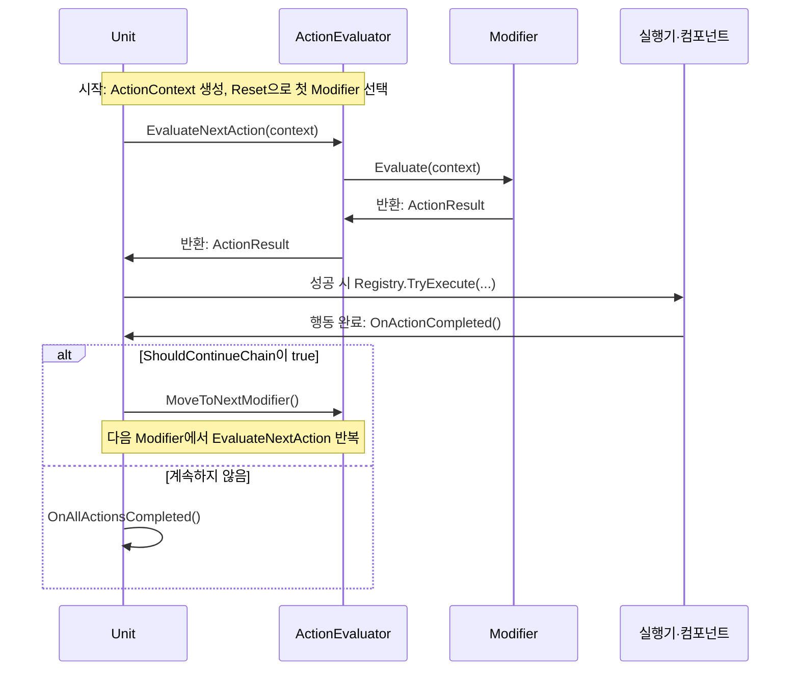
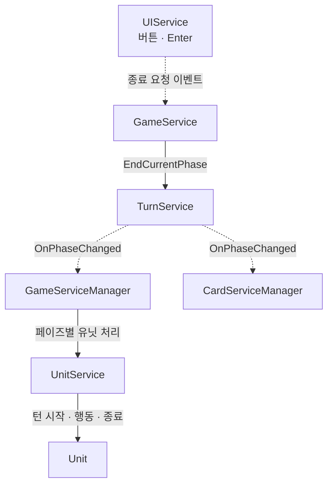
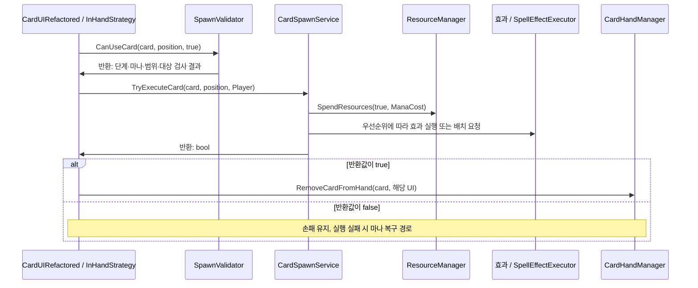
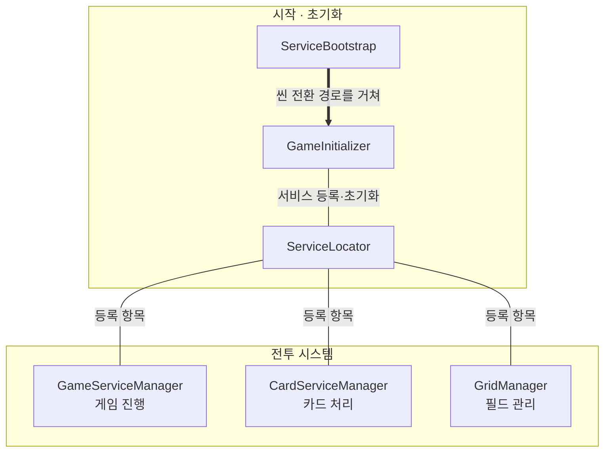

# Urban Tour — 메인 구조와 실행 흐름

> README v3 · 2026-10-01 UTC 정적 코드 검토
>
> 설명 기준은 원본 `feature/carddata-refactoring`의 **`8b1f53250f18e622b71ca302cfda816433d14852`**이다. 아래 설명의 “현재”는 이 커밋을 뜻한다. 기존 README의 3단계 설명이나 원본 `main`의 동작을 합쳐 설명하지 않는다.

## 기준 버전과 실행 범위

- 원본: [als79gur49/2025-2TeamProject](https://github.com/als79gur49/2025-2TeamProject), 비공개 저장소.
- 원본 고정 커밋: [8b1f53250f18e622b71ca302cfda816433d14852](https://github.com/als79gur49/2025-2TeamProject/commit/8b1f53250f18e622b71ca302cfda816433d14852).
- 공개 열람 사본: [2025-2TeamProject-code-portfolio](https://github.com/als79gur49/2025-2TeamProject-code-portfolio). README v3 게시 전 재확인한 사본 `main` head는 `0900af0f82bedc4a8eaca564813189200d42fbf6`이다. 원본 커밋과 공개 사본의 게시 커밋은 서로 다른 이력에 속한다.
- 2026-10-01 UTC 조회 시 원본의 기본 브랜치는 `main`이다. 원본 `feature/carddata-refactoring` head는 위 고정 커밋과 일치한다. `main` head `f938b3502f829ad74d83936e4db52974267111cf`와 비교하면 158커밋 앞서고 0커밋 뒤처진다. 브랜치 조회에는 `2025-10-17colleage`도 포함된다.
- 공개 사본의 [기존 README](https://github.com/als79gur49/2025-2TeamProject-code-portfolio/blob/0900af0f82bedc4a8eaca564813189200d42fbf6/README.md)와 동일한 원본 버전을 설명한다. 아래 코드 링크도 이 공개 사본의 게시 커밋으로 고정했다.

**공개 사본은 바로 실행할 수 있는 Unity 프로젝트가 아니다.** 씬, 프리팹, 미디어, 실제 ScriptableObject 데이터, 외부 DLL 및 Unity `.meta` 등이 제외되어 있다. `ReviewContext/Packages/`와 `ReviewContext/ProjectSettings/`는 원본 환경을 설명하는 자료다. 패키지를 설치하는 것만으로 사본을 실행할 수 있게 되지는 않는다.

원본 환경 자료에는 Unity **2022.3.62f1**, URP 14.0.12, TextMeshPro 3.0.7, Cinemachine 2.10.5 등이 기록되어 있다. DOTween/Pro 참조도 코드에 남아 있다. 원본 전체 프로젝트와 필요한 자산·의존성을 갖춘 환경에서 원본 씬 구성을 사용해야 한다. 여기서는 빌드, Unity 실행, 플레이 테스트를 수행하지 않았으며 실제 카드 값, 씬의 Inspector 연결 및 애니메이션 결과를 재현했다고 주장하지 않는다.

## 1. Unit 내부의 행동 체인

**미리 정렬한 Modifier 순서에서 현재 행동을 평가하고, 실행 완료 뒤 다음 Modifier를 새로 평가한다.** 다음 행동의 실행 결과를 미리 만들어 두는 방식은 아니다.



실행기·컴포넌트는 한 참가자로 묶었다. 평가 실패 시에는 실행을 건너뛰고 아래 규칙으로 다음 평가 또는 종료를 선택한다.

- **Modifier — 행동 후보의 규칙:** [Unit.Init()][unit]가 UnitData의 modifier를 생성·등록한다. 각 modifier의 Priority는 순서를 정하고, Evaluate는 조건·대상 selector를 통해 공격 타일이나 이동 목적지, 성공 여부·연쇄 규칙을 담은 [ActionResult][action-interface]를 만든다.
- **Evaluator — 현재 후보 평가:** [RebuildChain()][evaluator]이 Priority 내림차순으로 체인을 구성한다. 현재 modifier를 평가하고, 실패해도 ShouldContinueChain이 true이면 다음 modifier로 넘어가 다시 평가한다. 모든 행동의 점수를 비교해 최댓값을 고르는 과정은 없다.
- **Unit — 선택된 행동 실행:** EvaluateAndExecuteNextAction이 성공 결과를 저장하고 [Registry.TryExecute()][executors]로 타입에 맞는 실행기에 전달한다. 평가가 최종 실패하거나 체인이 비면 전체 행동을 종료한다.
- **완료 뒤 다음 행동 선택:** [OnActionCompleted()][unit]는 결과의 ShouldContinueChain에 따라 평가기 포인터를 다음 modifier로 옮기고 **그 modifier를 다시 평가**한다. 성공 뒤에는 AlwaysContinue·ContinueOnSuccess가 계속하고, FallbackOnFailure·AlwaysTerminate는 종료한다. 체인 순서는 유지하되 대상·실행 가능 여부는 평가 시점에 결정한다.

## 2. 한 턴: 실제 6단계

[TurnPhase][phase]와 [TurnService.GetNextPhase()][turn]의 순서는 아래와 같다.

```text
TurnStart → EnemySummon → AllySummon → EnemyAction → AllyAction → TurnEnd
    ↑                         다음 턴                              ↓
    └─────────────────────────────────────────────────────────────┘
```

StartGame은 TurnCount와 PhaseCount를 0으로 시작한다. EndCurrentPhase의 성공마다 PhaseCount가 증가하고 6회 전환마다 TurnCount가 증가한다. 화면은 첫 사이클을 TurnCount + 1로 표시한다. 실제 단계 수는 UI의 남아 있는 문자열이나 과거 3단계 문서가 아니라 enum·전환 코드로 확인한다.



`UIService.OnEndTurnRequested` → [GameService.HandleEndPhaseRequest()][game-service] → TurnService.EndCurrentPhase가 정상 전환 요청이다. OnPhaseChanged의 구독자 실행 순서를 그림으로 고정하지 않는다.

| 단계 | 카드·자원 | 유닛 |
| --- | --- | --- |
| TurnStart | 카드 관리자가 양 팀 최대 마나 증가·전량 충전, 플레이어 DrawRandomCard, 적 DrawCard(1) | OnTurnStart: 이동·추가 행동 상태 초기화, 턴 시작 효과 |
| EnemySummon | 적 AI의 카드 계획·실행 코루틴 | 빈 처리 목록 |
| AllySummon | 플레이어 손패 드래그 허용 | 빈 처리 목록 |
| EnemyAction | 플레이어 소환 모드 비활성 | 적 Act 순차 처리 |
| AllyAction | 플레이어 소환 모드 비활성 | 플레이어 Act 순차 처리 |
| TurnEnd | 카드 관리자의 준비·정리 메서드는 현재 로그만 출력 | OnTurnEnd: 종료 효과·지속시간·추가 행동 자격 정리 |

[ResourceManager.IncreaseTurnlyMana()][resources]는 양쪽 최대 마나를 cap까지 1 늘린 뒤 충전한다. ResourceManager의 별도 페이즈 구독문은 주석 처리되어 있어 소환 단계의 추가 회복을 현재 흐름에 합치지 않는다.

EndCurrentPhase는 GameFlowLock·PhaseLock이 있으면 거절한다. 버튼도 실행 상태·잠금에 맞춰 비활성화되지만 Enter는 버튼의 interactable을 검사하지 않는다. 실행 중 요청은 `CancelCurrentPhase(true)`를 거칠 수 있다. 이 단축 경로는 코루틴을 중단하고 현재 인덱스부터 남은 유닛에 페이즈 구분 없이 Act를 호출하므로, 정상 완료 대기나 순수 로직 실행으로 설명하지 않는다.

## 3. 카드 드로우·사용·효과

### 손패 준비와 드로우

[CardHandManager.Init()][hand]는 Inspector의 initialHandCards를 넣는다. 저장된 덱을 얻으면 [CardServiceManager.LoadPlayerDeck()][card-manager] → LoadDeck → SetupInitialHandFromDeck으로 기존 손패를 비우고 섞은 덱에서 초기 손패를 뽑는다.

DrawRandomCard는 초기화·손패 상한 검사 → 덱의 다음 카드 제거 → 덱 경로를 쓸 수 없으면 availableCards에서 무작위 선택 → AddCardToHand → UI 생성·레이아웃 갱신 순이다. **로드된 덱이 소진된 경우도 fallback에 들어갈 수 있다.** 적 DrawCard는 카드 풀의 드로우 전략으로 enemyHand에 추가하고 OnCardDrawn을 발생시킨다. 조합을 고르는 DP와 드로우 전략은 별개다.

### 한 장을 드래그해 사용할 때



1. [CardUIRefactored][card-ui]가 현재 전략에 입력을 전달한다. [InHandStrategy.HandleDrop()][in-hand]은 raycast로 Tile을 찾고 드롭 위치를 다시 검증한다.
2. [SpawnValidator.CanUseCard()][validator]가 진행 잠금, 마나, 팀별 소환 단계, 좌표, 대상 종류·기지 기준 범위·효과 대상 존재를 확인한다. 플레이어는 AllySummon, 적은 EnemySummon에서만 허용한다.
3. [CardSpawnService.TryExecuteCard()][spawn]는 GameContext에 사용 카드·시전자 팀·원점·서비스를 담고 마나를 먼저 차감한다. 효과 정의 없는 카드는 거절하며 효과 실행 실패에는 마나 복구 경로가 있다.
4. 반환값이 true이면 InHandStrategy.OnCardUsed → RemoveCardFromHand(card, cardUI)로 사용 손패·UI를 제거한다. false이면 손패 위치·레이아웃을 복원한다.

TryExecuteCard는 내부에서 CanUseCard 전체 검사를 다시 하지 않는다. 직접 호출자는 플레이어 전략·적 AI처럼 검증을 별도로 수행해야 한다.

### 정의, 대상 계산과 실제 적용

[CardData][card-data]의 [EffectDefinition][definition] 목록을 [CardEffectFactory][factory]가 실행 객체로 만들고 우선순위 내림차순으로 정렬한다. 정의에는 범위 모양, 대상 필터, TileBased/Global, VFX 설정이 있다. [EffectTargetingHelper][targets]는 AreaShape 후보에 TargetFilter를 적용한다. Global 효과는 타일 목록을 대상으로 삼지 않는다. 예를 들어 [DrawCardsEffect][draw]는 대상 팀을 계산해 DrawCardsForTeam을 호출한다.

VFX 정의와 실행기가 있으면 [SpellEffectExecutor.ExecuteBatch()][spell]로 배치 요청한다. 정렬된 첫 효과의 VFX 설정을 사용하고 대상 계산·trigger에 맞춰 효과를 호출하며 진행 잠금을 요청·해제한다. **TryExecuteCard의 true 반환과 피해·소환 적용 완료 시점은 다를 수 있다.**

[SummonEffect.SummonUnitAtTile()][summon]는 Prefab 생성 → Unit.Init → UnitCardLink의 카드 연결 → GridController.MoveUnit으로 배치 → UnitService.RegisterUnit → 현재 타일·팀 방향 설정 순이다. OnDeploy는 직접 호출하는 대신 그리드 최초 배치 이벤트 → [UnitPlacementCoordinator.HandleUnitPlaced()][placement] → Unit.OnPlaced → 효과로 연결된다. 이 이벤트는 유닛 서비스 등록보다 먼저 발생할 수 있다.

확인된 한계는 다음과 같다.

- VFX 경로의 true는 모든 효과 완료·성공의 확인값이 아니다. 즉시 경로도 successCount > 0이면 성공하며 이미 적용한 효과를 되돌리는 transaction이 없다.
- 새 [GameContext][context]의 PredeterminedTiles는 비어 있고 VFX 없는 직접 경로에서 채우지 않는다. [SummonEffect][summon]·[DamageEffect][damage]의 CanExecute는 빈 목록에서 실패한다. 모든 효과가 VFX 유무와 무관하게 동일하게 작동한다고 설명할 수 없다.
- VFX 대상은 효과들의 타일을 합쳐 문맥에 담는다. 정의별 trigger·필터와 즉시 경로를 동일한 대상 처리로 단정하지 않는다.

## 4. 적 카드 AI: 평가·조합 선택·재검증

[EnemyAIController][enemy]는 1절의 유닛 행동 체인과 별도로 **적 손패 사용**을 계획한다.

1. ExecuteSummonPhaseCoroutine이 마나·손패를 읽고 PlanCardsForCurrentState가 지불 가능한 항목을 평가한다.
2. CalculateBestSituationalValue가 후보 좌표의 배치 유효성·CalculateValueAtPosition 값을 비교해 최대 값과 위치를 [CardValueInfo][value]에 저장한다. 후보가 없거나 전체 타일의 80%를 넘으면 전체 탐색 분기도 사용한다.
3. 가치가 양수인 후보를 [KnapsackCardSelector.SelectOptimalCards()][knapsack]로 전달한다.
4. ExecuteSelectedCardsCoroutine은 카드마다 GameFlowLock·마나를 확인하고 RevalidateAndMaybeRecalculate로 위치·가치를 재검증한다. 무효이거나 가치가 없으면 재평가 또는 건너뛴다.
5. TryExecuteCard(..., Enemy)가 true이면 손패에서 제거하고 OnCardUsed를 발생시킨다. 상태가 바뀐 뒤 다시 계획할 수 있다. 재계획은 최대 5회, 성공 합계가 20 이상이면 바깥 루프 종료이며 선택 목록을 정확히 20장으로 자르는 방식은 아니다.

소환의 체력+공격력+이동 범위, 피해의 대상 수×피해량, 드로우 장수×2 등은 휴리스틱 값이다. 미래 턴·모든 필터·효과·조합 시너지를 완전하게 시뮬레이션한 점수가 아니다.

후보 N개, 마나 M에서 DP는 앞의 i개 후보로 마나 w 이내에서 얻을 수 있는 가치 합을 저장한다.

```text
cost > w: dp[i,w] = dp[i-1,w]
그 외:    dp[i,w] = max(dp[i-1,w], value + dp[i-1,w-cost])
```

이전 행을 참조하므로 손패의 한 항목을 반복 사용하지 않는 **0/1 배낭**이다. 같은 카드가 여러 장이면 각 손패 항목을 별도로 취급한다. 행 차이로 역추적하고 순서를 뒤집어 선택 목록을 만든다. 시간·메모리는 O(N×M)이다. 가상 예로 마나 5, A(비용3·가치8), B(2·6), C(4·9)이면 A+B의 가치14를 선택한다.

최적화 범위는 **그 시점의 고정된 개별 가치 합**이다. 실행 후 점유·효과 대상이 달라지며 전역 전략 최적성은 보장하지 않는다. maxMana ≤ 0이면 빈 목록이고 역추적은 남은 마나가 0이면 멈추므로 0비용 카드의 일반적인 최적 선택도 보장한다고 쓰지 않는다.

## 5. 전체 구조

전투의 중심은 페이즈 상태, 카드·유닛 처리, UI·필드 표시다. 아래 그림은 시작과 주요 등록 항목의 구성 관계다.



위 그림은 시작 지점과 등록된 주요 시스템을 보여준다. Bootstrap 이후의 메뉴·스테이지 씬 등 중간 경로는 생략했으며, GameInitializer는 전투 씬 진입 후의 초기화를 뜻한다. ServiceLocator는 구현 인스턴스를 저장·조회하는 곳이다. 선의 방향으로 서비스를 생성하거나 실행을 지휘하는 것으로 읽지 않는다.

주요 시스템의 하위 구성은 역할별로 정렬해 읽는다. 표의 행과 나열 순서는 실행 순서가 아니다.

| 주요 시스템 | 하위 구성 | 역할 |
| --- | --- | --- |
| GameServiceManager | TurnService<br/>UnitService<br/>UIService<br/>GameService | 페이즈 상태<br/>유닛 순차 처리<br/>표시·입력<br/>게임 활성 상태 |
| CardServiceManager | CardHandManager<br/>SpawnValidator<br/>CardSpawnService<br/>EnemyAIController<br/>EnemyCardHandView | 플레이어 손패<br/>사용 조건 검사<br/>카드 효과 실행 연결<br/>적 손패 계획·실행<br/>적 손패 표시 |
| GridManager | GridState<br/>GridController<br/>GridRenderer | 좌표·점유 데이터<br/>조회·경로·갱신<br/>타일·강조·preview |

페이즈별 실제 호출은 2절의 실행 흐름도에서, 카드 한 장의 사용 순서는 3절의 시퀀스에서 확인한다.

## 6. UI와 게임 상태 연결

| 상태 또는 입력 | 연결과 표시 |
| --- | --- |
| 페이즈 변경 | TurnService 이벤트 → UIService의 텍스트·색상·이미지 갱신, 카드 관리자의 소환 모드 변경 |
| 유닛 단계 시작·완료·취소 | UnitService 이벤트 → UIService 종료 버튼과 진행 표시 갱신 |
| GameFlowLock 변화 | [GlobalStateManager][global-state] 이벤트 → UIService, CardHandManager, SpawnValidator의 입력 제한 |
| 마나 변화 | ResourceManager 이벤트 → [ManaHudUI][mana-ui]의 텍스트와 슬라이더 갱신 |
| 카드 드로우·사용 | 플레이어는 CardHandManager의 목록/UI 직접 갱신, 적은 OnCardDrawn/OnCardUsed → 적 손패 view 새로고침 |
| 카드 포인터 입력 | CardUIRefactored → 현재 모드 전략 → 카드 정보·드래그 이벤트 채널과 그리드 preview |
| 기지 사망 | BaseManager → GameOutcomeManager → GameService 종료 및 GameUICoordinator의 승패 패널 |

GlobalStateManager는 잠금 종류별 요청자 집합을 관리한다. `SetBusy(requester, type)`와 `SetIdle(requester, type)`을 통해 여러 요청자를 구분하며, 마지막 요청자가 해제될 때 상태 변화 이벤트를 보낸다. timeout에 의한 자동 해제도 있다. 여기서 “전역 상태”는 카드 손패나 모든 게임 데이터를 한곳에 저장한다는 뜻이 아니라, 주로 진행과 연출의 busy 상태를 공유한다는 뜻이다.

## 7. 시작 지점과 서비스 의존성

### 진입과 초기화

원본 고정 커밋의 [EditorBuildSettings.asset](https://github.com/als79gur49/2025-2TeamProject/blob/8b1f53250f18e622b71ca302cfda816433d14852/ProjectSettings/EditorBuildSettings.asset)에서 첫 활성 씬은 `Assets/Scenes/TestScenes/Prototypes/BootStrapScene.unity`다. [ServiceBootstrap.Awake()][bootstrap]는 중복 방지·DontDestroyOnLoad 후 씬 로더, 오디오, 카드 registry, 저장·플레이어·스테이지 진행, 씬 전환, 전역 UI 서비스를 초기화한다. Start는 직렬화된 initialSceneData로 씬 전환을 요청하므로 다음 씬 이름을 코드만으로 고정하지 않는다.

전투 씬의 [GameInitializer.Start()][initializer]는 autoInitializeOnStart이면 InitializeGame을 호출한다. Bootstrap 유무에 따른 Locator 보존/초기화 → 스테이지 문맥 → 전역 진행 상태·그리드·modifier factory·게임·자원·카드·VFX·Base·승패·표시·사망 서비스 등록 → HealthComponent 의존성 전달 → 검증·MarkAsInitialized → 데이터가 있을 때 게임 세션 준비 순이다. 이어 [SceneInitializer][scene-init]의 UI·Coordinator 초기화 절차를 수행한다.

실제 전투 시작은 [GameServiceManager.Start()][game-manager]가 하위 컴포넌트 준비·이벤트 연결 → TurnService.Init → UnitService.Init → UIService.Init → GameService.Init → Base 초기화 → GameService.StartGame → TurnService.StartGame을 호출하는 경로다.

고정 원본 meta의 [GameInitializer](https://github.com/als79gur49/2025-2TeamProject/blob/8b1f53250f18e622b71ca302cfda816433d14852/Assets/Script/Game/Core/GameInitializer.cs.meta) executionOrder는 −3, [GameServiceManager](https://github.com/als79gur49/2025-2TeamProject/blob/8b1f53250f18e622b71ca302cfda816433d14852/Assets/Script/Game/Services/GameServiceManager.cs.meta)는 0이다. 카드 초기화는 게임 관리자의 Start 이전에 하위 서비스를 조회할 수 있어 Inspector 연결이 중요하다. 이 meta와 씬 자료는 공개 사본에 없다.

### Locator 조회와 명시적인 전달

[ServiceLocator][locator]는 Dictionary<Type, object>에 Register<TInterface>로 구현을 저장하고 Get<TInterface>로 조회한다. 미등록 조회는 경고·null, 같은 타입 재등록은 덮어쓰기다.

| 조회 인터페이스 | 접근하는 기능 |
| --- | --- |
| IGameServiceManager | TurnService·UnitService·UIService·GameService |
| IGridManager | GridController·GridState·GridRenderer |
| ICardServiceManager | CardHandManager·SpawnValidator·CardSpawnService·적 손패 view |
| IResourceManager / IGlobalStateManager | 마나 / 진행 잠금 |
| ICardRegistry | 카드 ID 조회 |

CardServiceManager.InitializeCardServices는 그리드·턴·유닛을 얻어 SpawnValidator.Init, CardSpawnService.Init, CardHandManager.Init, EnemyAIController.Initialize에 전달한다. 카드 하위 서비스를 Locator에 각각 등록하는 방식은 아니다.

[Inject] reflection 처리도 있지만 Init 인자, Locator 직접 조회, GetComponent, Inspector의 구체 클래스 참조를 함께 쓴다. Locator는 조회 수단이며 서비스 생성·초기화 순서를 자동 보장하는 컨테이너가 아니다.

## 8. 코드 읽기 순서

아래 경로는 모두 `Assets/Script/` 아래다. 전체 경로와 추가 메서드는 부록에 있다.

1. [Game/Services/UnitService.cs][units] → [Game/Unit.cs][unit]: 페이즈 대상·정렬·대기와 Act의 실제 분기부터 읽는다.
2. [Game/Core/ActionEvaluator.cs][evaluator] → [Game/Interfaces/IActionModifier.cs][action-interface] → [Game/Core/Modifiers/ModifierFactory.cs][modifier-factory]: 평가 포인터·연쇄 규칙·UnitData 등록을 연결한다.
3. [Game/Components/Abilities/MovementModifiers/NormalMoveModifier.cs][move-modifier] / [AttackModifiers/MeleeModifier.cs][melee-modifier] → [TargetSelectorProvider.cs][selector-provider]: 조건과 후보 생성 규칙을 본다.
4. [Game/Core/ActionExecutorRegistry.cs][executors] → [MovementActionExecutor.cs][move-executor] / [AttackActionExecutor.cs][attack-executor] → [Game/Components/MovementComponent.cs][movement] / [CombatComponent.cs][combat]: 실제 위치·체력 변경과 완료 콜백을 따라 Unit으로 돌아온다.
5. [TurnPhase.cs][phase] → [TurnService.cs][turn] → [GameService.cs][game-service]: 처리 완료와 다음 페이즈 요청을 구분한다.
6. [CardHandManager.cs][hand] → [InHandStrategy.cs][in-hand] → [SpawnValidator.cs][validator] → [CardSpawnService.cs][spawn] → [SpellEffectExecutor.cs][spell] / [SummonEffect.cs][summon]: 드로우부터 효과·유닛 등록까지 따라간다.
7. [Game/AI/EnemyAIController.cs][enemy] → [CardValueInfo.cs][value] → [KnapsackCardSelector.cs][knapsack]: 카드 위치 평가·예산 선택·재검증을 읽는다.
8. [ServiceBootstrap.cs][bootstrap] → [GameInitializer.cs][initializer] → [ServiceLocator.cs][locator] → [GameServiceManager.cs][game-manager] / [CardServiceManager.cs][card-manager]: 앞서 사용한 서비스가 준비되는 곳을 확인한다.
9. [UIService.cs][ui] → [ManaHudUI.cs][mana-ui] → [GlobalStateManager.cs][global-state] → [GameOutcomeManager.cs][outcome]: 표시·입력·잠금·종료를 연결한다.

## 9. 확인 범위와 남아 있는 불일치

호출·조건·데이터 변경은 고정 소스에서 확인한 사실이다. 판단 결과와 실행기의 분리를 역할 구분 의도로 읽을 수 있지만 이는 해석이며 순수 함수화·SOLID 준수·설계 완성도·성능·테스트 통과를 증명하지 않는다.

각 절의 실행 한계 외에 다음도 남아 있다.

- 행동 체인에는 일부 modifier의 내부 fallback과 평가기의 다음 단계 처리가 함께 있다. SelectedModifier와 평가기 포인터가 달라질 수 있어 modifier별 한 번 실행을 보장하지 않는다. ActionContext.ActorPosition도 생성 후 이동 완료에 맞춰 갱신하는 대입을 찾지 못했다.
- Registry의 true는 실행기 호출 여부다. 이동 실패 반환 미확인·컴포넌트 누락 등 완료 콜백 없는 분기가 있으며, UnitService의 대기는 애니메이션 재생 확인 후 전역 GameFlowLock을 최대 20초 기다리는 조건부 처리다. 잠금 timeout을 정상 행동 완료로 해석하지 않는다.
- 씬·프리팹·실제 데이터·외부 라이브러리가 없어 Inspector 연결과 실제 연출·플레이 결과를 검증하지 않았다.
- EnemyAIController.Initialize는 유효한 카드 풀이 없으면 초기화 플래그를 세우지 않고 종료한다. 이후 SetCardPool은 이 플래그를 true로 만들지 않아 스테이지 데이터 설정만으로 복구한다고 단정할 수 없다.
- UIService의 일반 표시는 /6이지만 HandlePhaseStarted의 처리 중 문자열에는 /4가 남아 있다.
- CardData.ExecuteCard와 BasicUnitAI의 존재를 현재 카드·Act 실행 경로로 소개하지 않는다.
- 공개 사본의 [기존 README](https://github.com/als79gur49/2025-2TeamProject-code-portfolio/blob/0900af0f82bedc4a8eaca564813189200d42fbf6/README.md)에 기록된 패키지·에디터 import·구 API 테스트 참조도 실행 가능성의 제약이다.

Unity 실행·빌드·플레이 테스트와 소스·에셋 수정은 수행하지 않았다. 이 README v3는 문서만 갱신해 공개 사본에 게시했다. Mermaid는 코드 블록·노드·참조의 정적 검사를 했으며 실제 렌더링으로 글꼴·간격·넘침을 검증한 결과는 아니다.

## 부록. 근거 파일·메서드와 검증 기록

<details>
<summary>코드 경로·메서드 목록과 버전 검증 기록 펼치기</summary>

코드 링크는 공개 사본 `0900af0f82bedc4a8eaca564813189200d42fbf6`의 파일에 고정되어 있다. 파일 안에서 아래 메서드 이름을 검색하면 관련 조건과 호출부를 함께 읽을 수 있다.

| 근거 경로 (Assets/Script/ 기준) | 주요 메서드·요소 |
| --- | --- |
| [Game/Core/ServiceBootstrap.cs][bootstrap] | Awake, InitializeServices, Start, LoadInitialSceneAsync |
| [Game/Core/GameInitializer.cs][initializer] | Start, InitializeGame, RegisterCoreServices, RegisterGameServices, RegisterCardServices |
| [Game/Core/SceneInitializer.cs][scene-init] | InitializeSceneWorkflow |
| [Game/Core/ServiceLocator.cs][locator] | Register, RegisterSingleton, Get, Clear, MarkAsInitialized, InjectDependencies |
| [Game/Services/GameServiceManager.cs][game-manager] | Start, InitializeServices, InitializeIndividualServicesManually, ConnectServiceEvents, HandlePhaseChanged |
| [Game/Services/GameService.cs][game-service] | StartGame, HandleEndPhaseRequest, EndGame, RestartGame |
| [Game/Managers/CardServiceManager.cs][card-manager] | InitializeCardServices, LoadPlayerDeck, HandlePhaseChanged, HandleTurnStartPhase, DrawCardsForTeam |
| [Game/Services/TurnPhase.cs][phase] | TurnPhase, PhaseExecutionState |
| [Game/Services/TurnService.cs][turn] | StartGame, EndCurrentPhase, GetNextPhase |
| [Game/Services/UnitService.cs][units] | GetActiveUnits, GetUnitsInGridOrder, ProcessUnitsForPhaseAsync, GetUnitsForPhase, ExecutePhaseSequentially, ProcessUnitActionAsync, WaitForAnimationComplete, CompleteCurrentPhase, CancelCurrentPhase |
| [Game/Services/ResourceManager.cs][resources] | IncreaseTurnlyMana, SpendResources, ConnectToTurnService, NotifyResourceChanged |
| [ScriptableObjects/CardData.cs][card-data] | EffectDefinitions, IsEffectBasedCard, ExecuteCard |
| [Game/Services/Card/CardHandManager.cs][hand] | Init, LoadDeck, SetupInitialHandFromDeck, DrawRandomCard, AddCardToHand, RemoveCardFromHand |
| [Game/Card/UI/Refactored/CardUIRefactored.cs][card-ui] | OnBeginDrag, OnDrag, OnEndDrag, CreateContextForMode |
| [Game/Card/UI/Refactored/Strategies/InHandStrategy.cs][in-hand] | HandleDrop, ValidateDropPosition, OnDragEndInternal, OnCardUsed |
| [Game/Services/Card/SpawnValidator.cs][validator] | CanUseCard, ValidatePhaseForSpawn, ValidateTargetRange, HasAnyValidEffectTarget |
| [Game/Services/Card/CardSpawnService.cs][spawn] | TryExecuteCard, UpdateGameContext, ExecuteAllCardEffects, RestoreResources |
| [Game/Card/Effects/CardEffectFactory.cs][factory] | CreateEffect, CreateEffects |
| [Game/Card/Effects/EffectDefinition.cs][definition] | CreateRuntimeEffect, Priority, AreaShape, TargetFilter, TargetScope |
| [Game/Card/Effects/EffectTargetingHelper.cs][targets] | GetTargetTiles, GetAreaTiles |
| [Game/Card/Effects/GameContext.cs][context] | GameContext, PredeterminedTiles, IsValid |
| [Game/VFX/SpellEffectExecutor.cs][spell] | ExecuteBatch, ExecuteWithVFX, CalculateAllPotentialTargets, ExecuteEffectsWithDataList, ExecuteGlobalEffect |
| [Game/Card/Effects/SummonEffect.cs][summon] | CanExecute, ExecuteWithVFXData, SummonUnitAtTile |
| [Game/Card/Effects/DamageEffect.cs][damage] | CanExecute, Execute, ExecuteWithVFXData |
| [Game/Card/Effects/DrawCardsEffect.cs][draw] | ExecuteInternal, ResolveTargetTeam |
| [Game/Coordinators/UnitPlacementCoordinator.cs][placement] | Initialize, HandleUnitPlaced |
| [Game/GridManager.cs][grid-manager] | InitializeForServiceLocator, GetGridController, GetGridState, GetGridRenderer |
| [Game/Components/GridController.cs][grid] | CanMoveUnit, MoveUnit, TryMoveUnit, FindPathWithDetails, ValidateCardTargetRange |
| [Game/Components/GridState.cs][grid-state] | UpdateGridDataLayer, RemoveUnit, OnUnitPlaced, OnUnitMoved |
| [Game/Unit.cs][unit] | Awake, Init, OnPlaced, OnTurnStart, OnTurnEnd, Act, ExecuteAITurn, BeginNewActionChain, EvaluateAndExecuteNextAction, OnActionCompleted, ResumeActionChain, OnAllActionsCompleted, BuildActionTurnOutcome |
| [Game/Core/ActionEvaluator.cs][evaluator] | RebuildChain, Reset, EvaluateNextAction, MoveToNextModifier |
| [Game/Interfaces/IActionModifier.cs][action-interface] | IActionModifier.Evaluate/Execute, ActionContext, ActionResult.ShouldContinueChain |
| [Game/Core/ActionExecutorRegistry.cs][executors] | TryExecute, RegisterExecutor |
| [Game/Core/Executors/AttackActionExecutor.cs][attack-executor] | Execute |
| [Game/Core/Executors/MovementActionExecutor.cs][move-executor] | Execute |
| [Game/Core/Modifiers/ModifierFactory.cs][modifier-factory] | CreateFromData |
| [Game/Components/Abilities/MovementModifiers/NormalMoveModifier.cs][move-modifier] | Evaluate, CalculateFinalDestination |
| [Game/Services/Modifiers/TargetSelectors/MovementTargetSelector.cs][move-selector] | FindTargets |
| [Game/Components/MovementComponent.cs][movement] | ExecuteMoveWithResult, MoveToPosition, MoveAlongPathSequentially, MoveOneStep, OnMoveCompleted |
| [Game/Components/CombatComponent.cs][combat] | ExecuteAttackWithResult, OnAnimationAttackHit, ApplyCurrentAttackDamage, OnProjectileAttackFinished, OnAttackCompleted |
| [Game/Components/HealthComponent.cs][health] | ProcessDamage, ProcessDeath, TakeDamage |
| [Game/Components/BasicUnitAI.cs][old-ai] | DecideAction, FindBestTarget |
| [Game/Interfaces/IUnitAI.cs][old-interface] | IUnitAI, ActionDecision |
| [Game/AI/EnemyAIController.cs][enemy] | DrawCard, ExecuteSummonPhaseCoroutine, PlanCardsForCurrentState, CalculateBestSituationalValue, ExecuteSelectedCardsCoroutine, RevalidateAndMaybeRecalculate |
| [Game/AI/KnapsackCardSelector.cs][knapsack] | SelectOptimalCards |
| [Game/AI/CardValueInfo.cs][value] | Card, Value, Position, Cost |
| [Game/Services/UIService.cs][ui] | SubscribeToServiceEvents, OnEndTurnButtonClicked, HandleKeyboardInput, UpdateEndTurnButton, UpdateTurnStatusText |
| [Game/Services/GlobalStateManager.cs][global-state] | SetBusy, SetIdle, IsBusy, OnBusyStateChanged |
| [Game/UI/ManaHudUI.cs][mana-ui] | Start, HandlePlayerManaChanged, HandleEnemyManaChanged |
| [Game/Services/GameOutcomeManager.cs][outcome] | Initialize, HandlePlayerBaseDeath, HandleEnemyBaseDeath |
| [Game/Coordinators/GameUICoordinator.cs][game-ui] | SubscribeToGameEvents, HandleVictory, HandleDefeat |
| [Game/Components/Abilities/AttackModifiers/MeleeModifier.cs][melee-modifier] | Evaluate, HandleFailure, CalculateDamage |
| [Game/Services/Modifiers/TargetSelectors/MeleeTargetSelector.cs][melee-selector] | FindTargets, IsValidRelation |
| [Game/Services/Modifiers/TargetSelectors/RangedTargetSelector.cs][ranged-selector] | FindTargets, IsValidRelation |
| [Game/Services/Modifiers/TargetSelectors/TargetSelectorProvider.cs][selector-provider] | GetSelector, selectorMap |
| [Game/Components/Abilities/MovementModifiers/BoosterModifier.cs][booster-modifier] | Evaluate, HandleFailure |

검증 기록:

- 2026-10-01 UTC, 연결된 GitHub의 원본 저장소 metadata·브랜치 조회·커밋 조회·비교 결과로 위 기본 브랜치, 원본 head 및 158/0 차이를 재확인했다.
- 로컬 `UrbanTour-CodeReview-8b1f532/MANIFEST.csv`의 `kind=original` 413개 파일에 대해 SHA-256을 재계산했고 **413개 일치, 불일치 0개**였다. 이는 로컬 사본이 기록된 버전에서 변하지 않았음을 확인하는 검사이며 빌드 검사가 아니다.
- 원본 고정 커밋에서 TurnService, Unit, CardSpawnService, EnemyAIController를 다시 조회한 blob SHA는 각각 `2cc74cf2d4be13e7fe56fd2ddfeda96d94ee1ae2`, `27e0b857f85719764d1e749940ba32366b930b64`, `cecd6a1ec89dd8543d8bb78e14cca8832bbb91ce`, `96a6f24647b72f802303d9a846af28e7429bec02`다. 로컬 manifest의 해당 원본 blob 기록과 대조했다.
- 추가로 원본 고정 커밋의 EditorBuildSettings 및 두 초기화 클래스의 meta를 읽었다. 이 원본 문맥은 공개 사본에 없는 설정이며 위 링크로 구분했다.
- 제공된 사본과 이번 작업 폴더에는 `.agents/skills` 및 별도 AGENTS.md가 없었다. 과거 Codex 메모리는 소스 근거로 사용하지 않았다.

- 이번 재구성에서는 유닛 대상·정렬·행동 체인·이동·공격·완료·연쇄 분기를 재검토했다. 전체 C#에서 ActorPosition 대입을 검색한 결과 생성자 외 갱신 대입을 찾지 못했다. 이는 정적 검색 결과이며 실제 Unity 실행을 대신하지 않는다.

</details>

[bootstrap]: https://github.com/als79gur49/2025-2TeamProject-code-portfolio/blob/0900af0f82bedc4a8eaca564813189200d42fbf6/Assets/Script/Game/Core/ServiceBootstrap.cs#L73
[initializer]: https://github.com/als79gur49/2025-2TeamProject-code-portfolio/blob/0900af0f82bedc4a8eaca564813189200d42fbf6/Assets/Script/Game/Core/GameInitializer.cs#L67
[scene-init]: https://github.com/als79gur49/2025-2TeamProject-code-portfolio/blob/0900af0f82bedc4a8eaca564813189200d42fbf6/Assets/Script/Game/Core/SceneInitializer.cs#L55
[locator]: https://github.com/als79gur49/2025-2TeamProject-code-portfolio/blob/0900af0f82bedc4a8eaca564813189200d42fbf6/Assets/Script/Game/Core/ServiceLocator.cs#L28
[game-manager]: https://github.com/als79gur49/2025-2TeamProject-code-portfolio/blob/0900af0f82bedc4a8eaca564813189200d42fbf6/Assets/Script/Game/Services/GameServiceManager.cs#L100
[game-service]: https://github.com/als79gur49/2025-2TeamProject-code-portfolio/blob/0900af0f82bedc4a8eaca564813189200d42fbf6/Assets/Script/Game/Services/GameService.cs#L86
[card-manager]: https://github.com/als79gur49/2025-2TeamProject-code-portfolio/blob/0900af0f82bedc4a8eaca564813189200d42fbf6/Assets/Script/Game/Managers/CardServiceManager.cs#L160
[phase]: https://github.com/als79gur49/2025-2TeamProject-code-portfolio/blob/0900af0f82bedc4a8eaca564813189200d42fbf6/Assets/Script/Game/Services/TurnPhase.cs#L7
[turn]: https://github.com/als79gur49/2025-2TeamProject-code-portfolio/blob/0900af0f82bedc4a8eaca564813189200d42fbf6/Assets/Script/Game/Services/TurnService.cs#L74
[units]: https://github.com/als79gur49/2025-2TeamProject-code-portfolio/blob/0900af0f82bedc4a8eaca564813189200d42fbf6/Assets/Script/Game/Services/UnitService.cs#L157
[resources]: https://github.com/als79gur49/2025-2TeamProject-code-portfolio/blob/0900af0f82bedc4a8eaca564813189200d42fbf6/Assets/Script/Game/Services/ResourceManager.cs#L345
[card-data]: https://github.com/als79gur49/2025-2TeamProject-code-portfolio/blob/0900af0f82bedc4a8eaca564813189200d42fbf6/Assets/Script/ScriptableObjects/CardData.cs#L60
[hand]: https://github.com/als79gur49/2025-2TeamProject-code-portfolio/blob/0900af0f82bedc4a8eaca564813189200d42fbf6/Assets/Script/Game/Services/Card/CardHandManager.cs#L657
[card-ui]: https://github.com/als79gur49/2025-2TeamProject-code-portfolio/blob/0900af0f82bedc4a8eaca564813189200d42fbf6/Assets/Script/Game/Card/UI/Refactored/CardUIRefactored.cs#L430
[in-hand]: https://github.com/als79gur49/2025-2TeamProject-code-portfolio/blob/0900af0f82bedc4a8eaca564813189200d42fbf6/Assets/Script/Game/Card/UI/Refactored/Strategies/InHandStrategy.cs#L264
[validator]: https://github.com/als79gur49/2025-2TeamProject-code-portfolio/blob/0900af0f82bedc4a8eaca564813189200d42fbf6/Assets/Script/Game/Services/Card/SpawnValidator.cs#L149
[spawn]: https://github.com/als79gur49/2025-2TeamProject-code-portfolio/blob/0900af0f82bedc4a8eaca564813189200d42fbf6/Assets/Script/Game/Services/Card/CardSpawnService.cs#L154
[factory]: https://github.com/als79gur49/2025-2TeamProject-code-portfolio/blob/0900af0f82bedc4a8eaca564813189200d42fbf6/Assets/Script/Game/Card/Effects/CardEffectFactory.cs#L17
[definition]: https://github.com/als79gur49/2025-2TeamProject-code-portfolio/blob/0900af0f82bedc4a8eaca564813189200d42fbf6/Assets/Script/Game/Card/Effects/EffectDefinition.cs#L9
[targets]: https://github.com/als79gur49/2025-2TeamProject-code-portfolio/blob/0900af0f82bedc4a8eaca564813189200d42fbf6/Assets/Script/Game/Card/Effects/EffectTargetingHelper.cs#L22
[context]: https://github.com/als79gur49/2025-2TeamProject-code-portfolio/blob/0900af0f82bedc4a8eaca564813189200d42fbf6/Assets/Script/Game/Card/Effects/GameContext.cs#L13
[spell]: https://github.com/als79gur49/2025-2TeamProject-code-portfolio/blob/0900af0f82bedc4a8eaca564813189200d42fbf6/Assets/Script/Game/VFX/SpellEffectExecutor.cs#L73
[summon]: https://github.com/als79gur49/2025-2TeamProject-code-portfolio/blob/0900af0f82bedc4a8eaca564813189200d42fbf6/Assets/Script/Game/Card/Effects/SummonEffect.cs#L109
[damage]: https://github.com/als79gur49/2025-2TeamProject-code-portfolio/blob/0900af0f82bedc4a8eaca564813189200d42fbf6/Assets/Script/Game/Card/Effects/DamageEffect.cs#L27
[draw]: https://github.com/als79gur49/2025-2TeamProject-code-portfolio/blob/0900af0f82bedc4a8eaca564813189200d42fbf6/Assets/Script/Game/Card/Effects/DrawCardsEffect.cs#L60
[placement]: https://github.com/als79gur49/2025-2TeamProject-code-portfolio/blob/0900af0f82bedc4a8eaca564813189200d42fbf6/Assets/Script/Game/Coordinators/UnitPlacementCoordinator.cs#L52
[grid-manager]: https://github.com/als79gur49/2025-2TeamProject-code-portfolio/blob/0900af0f82bedc4a8eaca564813189200d42fbf6/Assets/Script/Game/GridManager.cs#L193
[grid]: https://github.com/als79gur49/2025-2TeamProject-code-portfolio/blob/0900af0f82bedc4a8eaca564813189200d42fbf6/Assets/Script/Game/Components/GridController.cs#L645
[grid-state]: https://github.com/als79gur49/2025-2TeamProject-code-portfolio/blob/0900af0f82bedc4a8eaca564813189200d42fbf6/Assets/Script/Game/Components/GridState.cs#L214
[unit]: https://github.com/als79gur49/2025-2TeamProject-code-portfolio/blob/0900af0f82bedc4a8eaca564813189200d42fbf6/Assets/Script/Game/Unit.cs#L647
[evaluator]: https://github.com/als79gur49/2025-2TeamProject-code-portfolio/blob/0900af0f82bedc4a8eaca564813189200d42fbf6/Assets/Script/Game/Core/ActionEvaluator.cs#L23
[action-interface]: https://github.com/als79gur49/2025-2TeamProject-code-portfolio/blob/0900af0f82bedc4a8eaca564813189200d42fbf6/Assets/Script/Game/Interfaces/IActionModifier.cs#L41
[executors]: https://github.com/als79gur49/2025-2TeamProject-code-portfolio/blob/0900af0f82bedc4a8eaca564813189200d42fbf6/Assets/Script/Game/Core/ActionExecutorRegistry.cs#L18
[attack-executor]: https://github.com/als79gur49/2025-2TeamProject-code-portfolio/blob/0900af0f82bedc4a8eaca564813189200d42fbf6/Assets/Script/Game/Core/Executors/AttackActionExecutor.cs#L11
[move-executor]: https://github.com/als79gur49/2025-2TeamProject-code-portfolio/blob/0900af0f82bedc4a8eaca564813189200d42fbf6/Assets/Script/Game/Core/Executors/MovementActionExecutor.cs#L11
[modifier-factory]: https://github.com/als79gur49/2025-2TeamProject-code-portfolio/blob/0900af0f82bedc4a8eaca564813189200d42fbf6/Assets/Script/Game/Core/Modifiers/ModifierFactory.cs#L97
[move-modifier]: https://github.com/als79gur49/2025-2TeamProject-code-portfolio/blob/0900af0f82bedc4a8eaca564813189200d42fbf6/Assets/Script/Game/Components/Abilities/MovementModifiers/NormalMoveModifier.cs#L47
[move-selector]: https://github.com/als79gur49/2025-2TeamProject-code-portfolio/blob/0900af0f82bedc4a8eaca564813189200d42fbf6/Assets/Script/Game/Services/Modifiers/TargetSelectors/MovementTargetSelector.cs#L22
[movement]: https://github.com/als79gur49/2025-2TeamProject-code-portfolio/blob/0900af0f82bedc4a8eaca564813189200d42fbf6/Assets/Script/Game/Components/MovementComponent.cs#L998
[combat]: https://github.com/als79gur49/2025-2TeamProject-code-portfolio/blob/0900af0f82bedc4a8eaca564813189200d42fbf6/Assets/Script/Game/Components/CombatComponent.cs#L1125
[health]: https://github.com/als79gur49/2025-2TeamProject-code-portfolio/blob/0900af0f82bedc4a8eaca564813189200d42fbf6/Assets/Script/Game/Components/HealthComponent.cs#L356
[old-ai]: https://github.com/als79gur49/2025-2TeamProject-code-portfolio/blob/0900af0f82bedc4a8eaca564813189200d42fbf6/Assets/Script/Game/Components/BasicUnitAI.cs#L56
[old-interface]: https://github.com/als79gur49/2025-2TeamProject-code-portfolio/blob/0900af0f82bedc4a8eaca564813189200d42fbf6/Assets/Script/Game/Interfaces/IUnitAI.cs#L13
[enemy]: https://github.com/als79gur49/2025-2TeamProject-code-portfolio/blob/0900af0f82bedc4a8eaca564813189200d42fbf6/Assets/Script/Game/AI/EnemyAIController.cs#L305
[knapsack]: https://github.com/als79gur49/2025-2TeamProject-code-portfolio/blob/0900af0f82bedc4a8eaca564813189200d42fbf6/Assets/Script/Game/AI/KnapsackCardSelector.cs#L21
[value]: https://github.com/als79gur49/2025-2TeamProject-code-portfolio/blob/0900af0f82bedc4a8eaca564813189200d42fbf6/Assets/Script/Game/AI/CardValueInfo.cs#L10
[ui]: https://github.com/als79gur49/2025-2TeamProject-code-portfolio/blob/0900af0f82bedc4a8eaca564813189200d42fbf6/Assets/Script/Game/Services/UIService.cs#L90
[global-state]: https://github.com/als79gur49/2025-2TeamProject-code-portfolio/blob/0900af0f82bedc4a8eaca564813189200d42fbf6/Assets/Script/Game/Services/GlobalStateManager.cs#L57
[mana-ui]: https://github.com/als79gur49/2025-2TeamProject-code-portfolio/blob/0900af0f82bedc4a8eaca564813189200d42fbf6/Assets/Script/Game/UI/ManaHudUI.cs#L22
[outcome]: https://github.com/als79gur49/2025-2TeamProject-code-portfolio/blob/0900af0f82bedc4a8eaca564813189200d42fbf6/Assets/Script/Game/Services/GameOutcomeManager.cs#L75
[game-ui]: https://github.com/als79gur49/2025-2TeamProject-code-portfolio/blob/0900af0f82bedc4a8eaca564813189200d42fbf6/Assets/Script/Game/Coordinators/GameUICoordinator.cs#L112
[melee-modifier]: https://github.com/als79gur49/2025-2TeamProject-code-portfolio/blob/0900af0f82bedc4a8eaca564813189200d42fbf6/Assets/Script/Game/Components/Abilities/AttackModifiers/MeleeModifier.cs#L40
[melee-selector]: https://github.com/als79gur49/2025-2TeamProject-code-portfolio/blob/0900af0f82bedc4a8eaca564813189200d42fbf6/Assets/Script/Game/Services/Modifiers/TargetSelectors/MeleeTargetSelector.cs#L22
[ranged-selector]: https://github.com/als79gur49/2025-2TeamProject-code-portfolio/blob/0900af0f82bedc4a8eaca564813189200d42fbf6/Assets/Script/Game/Services/Modifiers/TargetSelectors/RangedTargetSelector.cs#L23
[selector-provider]: https://github.com/als79gur49/2025-2TeamProject-code-portfolio/blob/0900af0f82bedc4a8eaca564813189200d42fbf6/Assets/Script/Game/Services/Modifiers/TargetSelectors/TargetSelectorProvider.cs#L15
[booster-modifier]: https://github.com/als79gur49/2025-2TeamProject-code-portfolio/blob/0900af0f82bedc4a8eaca564813189200d42fbf6/Assets/Script/Game/Components/Abilities/MovementModifiers/BoosterModifier.cs#L41

## 부록. 최초 공개 사본의 범위·출처·검증 기록

<details>
<summary>최초 게시 README의 보존 기록 펼치기</summary>

아래는 최초 공개 사본 커밋 `0900af0f82bedc4a8eaca564813189200d42fbf6`의 README 원문이다. 파일 수, 해시·검증 기록, 작업 수행 여부와 코드 읽기 안내는 당시 게시 상태에 관한 기록이며, 현재 실행 흐름 설명은 위 1~9절을 기준으로 읽는다. 이번 갱신은 README.md만 변경했으므로 기존 MANIFEST.csv·VALIDATION.json의 README 해시는 이번 문서의 현재 해시를 나타내지 않는다.

# Urban Tour — 코드 열람용 포트폴리오

팀 프로젝트의 프로그래밍 구조를 검토하기 위한 로컬 소스 사본입니다. 씬·프리팹·실제 데이터·외부 자산과 Unity meta 파일을 제외했으므로 실행 가능한 Unity 프로젝트가 아닙니다. 이 사본에 대해 빌드, 실행 또는 테스트 통과를 주장하지 않습니다.

## 기준과 범위

- 원본: [als79gur49/2025-2TeamProject](https://github.com/als79gur49/2025-2TeamProject)
- 선택 브랜치: `feature/carddata-refactoring`
- 고정 커밋: [8b1f53250f18e622b71ca302cfda816433d14852](https://github.com/als79gur49/2025-2TeamProject/commit/8b1f53250f18e622b71ca302cfda816433d14852)
- Git 관찰: 선택 커밋은 조회 시 main의 `f938b3502f829ad74d83936e4db52974267111cf`보다 158커밋 앞서고 0커밋 뒤처집니다. 조회된 `2025-10-17colleage`와 main의 head도 선택 커밋의 이력에 포함됩니다.
- 사용자 확인: 최신 기준을 선택했습니다. 공식 최종 제출본이라는 증거는 확인하지 않았습니다.
- 사용자 확인 개발기간: **2025년 9~12월**.
- Git 커밋 관찰기간(UTC): 2025-09-06 04:25:25 ~ 2025-12-12 17:46:12. 이는 Git author 날짜 범위이며 실제 개발의 정확한 시작·종료일이나 제출일을 증명하지 않습니다.

원본 트리 19,230개 파일 / C# 436개를 이번 작업에서 GitHub 트리로 다시 확인했습니다. 포함 범위는 `Assets/Script/` 아래 C# 409개, `Assets/Script/Game.Scripts.asmdef`, 문맥 3개로 총 413개입니다. 문맥 파일의 원본 경로는 MANIFEST.csv에 기록하고 `ReviewContext/Packages/`와 `ReviewContext/ProjectSettings/`로 배치했습니다. 보조 문서 5개를 더해 총 418개 파일입니다.

원본 경로와 소스 바이트를 보존했습니다. 소스의 깨진 주석(예: UIPanelController)을 수정하지 않았습니다. 원본 README는 오래된 Claude 설계 초안이므로 복사하지 않고 이 문서를 새로 작성했습니다.

## 코드 읽기 안내

| 검토 주제 | 근거 파일 |
| --- | --- |
| 마나 예산 안에서 휴리스틱 가치에 따른 0/1 배낭 카드 조합 선택 | [KnapsackCardSelector](Assets/Script/Game/AI/KnapsackCardSelector.cs), [EnemyAIController](Assets/Script/Game/AI/EnemyAIController.cs), [CardValueInfo](Assets/Script/Game/AI/CardValueInfo.cs) |
| 6단계 턴 흐름 | [TurnPhase](Assets/Script/Game/Services/TurnPhase.cs), [TurnService](Assets/Script/Game/Services/TurnService.cs) |
| 그리드 이동과 전투 | [GridController](Assets/Script/Game/Components/GridController.cs), [Unit](Assets/Script/Game/Unit.cs), [UnitService](Assets/Script/Game/Services/UnitService.cs) |
| 카드 효과 정의와 적용 | [Effects 폴더](Assets/Script/Game/Card/Effects/) |
| 판단과 실행 분리 | [IUnitAI](Assets/Script/Game/Interfaces/IUnitAI.cs), [BasicUnitAI](Assets/Script/Game/Components/BasicUnitAI.cs), [Unit](Assets/Script/Game/Unit.cs) |
| ServiceLocator와 수동 의존성 주입 | [ServiceLocator](Assets/Script/Game/Core/ServiceLocator.cs), [GameInitializer](Assets/Script/Game/Core/GameInitializer.cs), [CardServiceManager](Assets/Script/Game/Managers/CardServiceManager.cs) |

카드 선택은 평가된 정수 가치의 조합을 마나 제약 아래 최적화합니다. 가치와 위치 평가는 휴리스틱이며, 이후 실행 및 필드 상태 변경이 있으므로 전체 게임 전략의 전역 최적성이나 카드 간 시너지의 완전한 최적화를 의미하지 않습니다. 턴 단계는 TurnStart → EnemySummon → AllySummon → EnemyAction → AllyAction → TurnEnd입니다.

## 원본 환경 문맥

ProjectVersion.txt와 manifest/lock 근거: Unity 2022.3.62f1, URP 14.0.12, TextMeshPro 3.0.7, Cinemachine 2.10.5, Newtonsoft JSON 3.2.2, Test Framework 1.1.33. 이는 원본 의존성 문맥이며 사본에서 설치하거나 실행한 결과가 아닙니다.

DOTween/Pro API 참조는 자체 코드에서 유지했고 외부 코드·DLL은 포함하지 않았습니다. 정확한 설치 버전은 미확인입니다. 고정 원본의 DOTween.dll(blob `57112d34beef1b8bb4f78782d752c7bef2452e0c`, 175,616바이트)과 DOTweenPro.dll(blob `1c376027b5137fc6b36b3334cf4115922de9adb3`, 16,384바이트)을 읽으려 했으나 연결 도구가 바이너리를 UTF-8로 해석하다 실패했습니다. 따라서 DLL 메타데이터·내장 버전 문자열은 조사하지 못했습니다. 라이브러리를 실행하거나 인증 경로를 우회하지 않았습니다.

원본의 두 DLL `.meta`는 Unity PluginImporter 설정만 담고 설치 버전이 없었습니다. 플러그인 readme와 Pro C# 8개의 버전 관련 문구도 확인했습니다. readme의 1.2.000 / 1.0.000 및 Pro 소스의 옛 버전 숫자는 업그레이드·호환성 안내이므로 설치 버전으로 쓰지 않았습니다. 읽기 시도·문서 blob 근거는 VALIDATION.json의 dotween 항목에 기록했습니다.

## 정적 제약과 보존된 불일치

- asmdef가 `Unity.InputSystem`을 참조하지만 manifest와 packages-lock에 `com.unity.inputsystem`이 없습니다.
- UnityEditor import 및 에디터 코드가 포함되어 있고, GameInitializer에는 `PlasticPipe.PlasticProtocol.Messages`, ActionEvaluator에는 `Codice.Client.BaseCommands.Import.Commit` import가 있습니다. 외부/에디터 의존성이 남아 있습니다.
- TileOccupancyIntegrationTest가 현행 GameServiceManager에 없는 `Instance` / `GetService<T>()` 구 API를 참조합니다. 테스트 이름이나 과거 커밋 메시지는 현 시점 테스트 통과 증거가 아닙니다.
- GridController.CanMoveUnit은 메서드 시작에서 즉시 `true`를 반환해 뒤의 검증 로직에 도달하지 않습니다.
- UIPanelController의 깨진 주석을 비롯한 원본 텍스트와 기존 코드는 그대로 보존했습니다.

이 항목들은 정적 열람 결과입니다. 원본 수정이나 버그 수정을 수행하지 않았습니다.

## 제외와 검증

후보 밖 C# 27개를 제외했습니다: DOTween/Pro 16개, Layer Lab 2개, Unity TutorialInfo 2개, 루트 CardUIRefactored_Improved_Part1/2 2개, backup_carddata 3개, Assets/_ConeAni.cs 및 Assets/Game_Practice/MapDrop.cs 각 1개. 정확한 제외 경로는 VALIDATION.json에 있습니다.

`Assets/_ConeAni.cs`는 Animator 상태 제어, `Assets/Game_Practice/MapDrop.cs`는 낙하·반동 연출을 위한 보조 코드입니다. 사용자에게 외부 제공 코드가 없다는 확인을 받았고, 두 파일을 추가한 [3ca800ba54a0aa200dc4c35e2dec1b2c77c940fa](https://github.com/als79gur49/2025-2TeamProject/commit/3ca800ba54a0aa200dc4c35e2dec1b2c77c940fa)는 GitHub author 계정 als79gur49에 연결됩니다. 계정 연결만으로 저작권을 증명하지는 않지만, 출처 불명이나 권리 우려를 제외 사유로 삼지 않습니다. 승인된 핵심 소스 폴더 `Assets/Script/` 밖의 보조 코드라는 범위상 이유로 제외했고 파일을 추가하지 않았습니다.

외부 자산·폰트·이미지·오디오·모델·셰이더·씬·프리팹·애니메이션·ScriptableObject 실제 데이터·meta·DLL, 원본 .git, 개발도구 설정, 원본 작업문서를 제외했습니다. ScriptableObject를 정의하는 자체 C# 코드는 포함하되 직렬화된 실제 데이터는 제외했습니다. 자체 코드의 외부 API 참조는 유지했습니다.

[MANIFEST.csv](MANIFEST.csv)는 포함 소스의 원본 blob SHA-1, 크기, 로컬 SHA-256와 보조 파일 해시를 기록합니다. [VALIDATION.json](VALIDATION.json)은 실제 파일 집합, 원본 SHA/크기, 허용 목록, 금지 경로, 비밀 패턴 검사 결과를 기록합니다. 검사는 정의된 패턴의 탐지 결과이며 모든 형태의 비밀 부재를 보장하지 않습니다. 자기참조 해시 한계는 VALIDATION.json에 명시했습니다.

공개 사본 저장소: [als79gur49/2025-2TeamProject-code-portfolio](https://github.com/als79gur49/2025-2TeamProject-code-portfolio). 사용자가 승인한 418개 파일을 원본 이력 없이 새 저장소에 게시하는 범위입니다. 원본 저장소는 Private로 유지합니다.

정확한 경로별 허용 목록 .gitignore를 작성했습니다. 로컬 Git 초기화, 원본 저장소 수정·공개 설정 변경, 새 라이선스 추가를 하지 않았고, .gitattributes를 만들거나 인코딩·개행을 정규화하지 않았습니다. VALIDATION.json은 게시용 파일 집합의 사전 검증 기록입니다. 실제 게시 성공과 원격 전체 대조 결과는 사본 밖 FINAL-VERIFICATION.json에 기록해 검증 파일의 자기참조를 피합니다.

팀 담당과 Git 근거는 [CONTRIBUTIONS.md](CONTRIBUTIONS.md)를 참조하세요.


</details>
